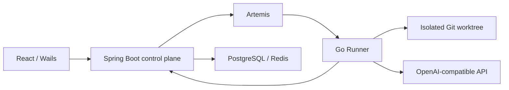

[简体中文](README.md) | [English](README.en.md) | [繁體中文](README.zh-TW.md) | [日本語](README.ja.md)

# ProofCode

ProofCode is a coding agent for verifiable changes: it reads repositories, generates patches, runs approved tools and tests, and produces changes that can be reviewed and recovered. It combines a Go agent engine, a Spring Boot control plane, a React web interface, and a Windows Wails desktop shell for everyday development workflows and undergraduate Computer Science research.

The workflow is **submit a goal → isolated worktree → tools and approval → patch → tests → artifact review → apply to the original checkout**.

## Versions and development status

The repository homepage follows `main`. Additional capabilities are published on separate development branches; use the documentation and configuration from the branch you check out.

| Branch | Published contents |
| --- | --- |
| [`main`](https://github.com/lgcyuzusakura/proofcode/tree/main) | Agent loop, tool approval, Git worktrees, recovery, artifacts, optional Jev routing, and web/desktop entry points |
| [`codex/backend-experiments-data-20261008`](https://github.com/lgcyuzusakura/proofcode/tree/codex/backend-experiments-data-20261008) | Project/workspace/conversation scope, four-route code retrieval, repeated-log compression, PostgreSQL/Redis gateway, executable A–F comparisons, and CI |
| [`codex/thesis-ccu-20261008`](https://github.com/lgcyuzusakura/proofcode/tree/codex/thesis-ccu-20261008/thesis) | Evidence-backed undergraduate thesis draft, Word/PDF, bibliography, and reproduction materials |
| [`codex/project-data-context-plan-20261008`](https://github.com/lgcyuzusakura/proofcode/blob/codex/project-data-context-plan-20261008/docs/plans/2026-10-08-project-data-context-plan.md) | Implementation plan for automatic desktop projects, visual database/cache management, historical RAG, and retrievable context |

Visual database/cache management, creating a desktop project when starting a chat without importing a folder, and historical multi-version retrieval are future work. The backend branch currently uses deterministic retrieval without embeddings; compression mainly removes identical successful logs. Its model and Jev fixtures verify engineering behavior, not real model performance or thesis improvement claims.

## Implemented on `main`

- OpenAI-compatible provider and tool calling, with step/usage budgets, cancellation, audit events, and a deterministic mock provider.
- Workspace file reads, paged file lists, `rg` search, structured patches, bounded commands, and Git diffs.
- An isolated Git worktree per task attempt, with checkpoints, complete messages, and recovery artifacts.
- Conditional Main, Scout, and Verifier coordination; Main is the only writer, while Scout and Verifier receive read-only tools.
- Optional Kev/Jev routing over a fixed tool candidate set; the generative model still supplies arguments.
- Spring Boot task APIs, database leases, cancellation/resume, WebSocket events, and a transactional PostgreSQL Outbox.
- A Go Runner consuming Artemis AMQP 1.0 tasks and reporting repository preparation, tool execution, and checkpoints.
- React project/task entry points, live events, approval/cancellation, an artifact timeline, and a Windows Wails desktop entry point.
- `proofcode-apply` checks the base revision and a clean checkout before applying a reviewed patch.
- Browser validation and MCP stdio libraries exist but are not connected to the Runner task loop.

## Quick start

Docker Desktop and Docker Compose are required. Real coding tasks also require a working OpenAI-compatible provider configuration.

```powershell
git clone https://github.com/lgcyuzusakura/proofcode.git
cd proofcode
Copy-Item .env.example .env
```

Set `MODEL_BASE_URL`, `MODEL_NAME`, and `MODEL_API_KEY` in `.env`, along with your own `DEV_AUTH_TOKEN` and `RUNNER_TOKEN`. Then run:

```powershell
docker compose up --build
```

Open [http://localhost:3000](http://localhost:3000). Compose waits for PostgreSQL, Redis, Artemis, and the control plane to become healthy before starting dependent services.

The current web interface reads its access token from browser storage. Open the developer tools Console, replace the placeholder below with `DEV_AUTH_TOKEN` from `.env`, and run:

```javascript
localStorage.setItem("proofcode.token", "<DEV_AUTH_TOKEN>");
location.reload();
```

For port conflicts, override `PROOFCODE_*_PORT` in `.env`, such as `PROOFCODE_WEB_PORT=3010` and `PROOFCODE_CONTROL_PORT=8090`.

### Windows desktop

The static preview requires Node.js/npm, Python 3, and Edge/Chrome. Native build scripts call `.tools/bin/wails.exe` directly and prefer `.tools/go/bin/go.exe`; these tools are not distributed with the repository. Prepare the local tools and WebView2 first. Alternatively, install system Wails 2.10.2 and run `wails dev` or `wails build` inside `desktop/native/`.

```powershell
# Static desktop UI preview
.\desktop\start-desktop.ps1

# Native Wails application; requires Go/Wails
.\desktop\start-native.ps1

# Rebuild the native application
.\desktop\build-native.ps1

# Stop the static preview server
.\desktop\stop-desktop.ps1
```

The desktop shell and shared interface still rely on the control plane and Runner for task execution; the static preview is for inspecting the interface. See the [desktop entry point](desktop/README.md) and [native application](desktop/native/README.md).

### Tool approval and runtime

Writes and commands require approval by default. `RUNNER_ALLOW_WRITE=true` and `RUNNER_ALLOW_EXEC=true` enable automatic file writes and commands respectively; path, command, and cancellation checks still apply.

The Runner image contains Go 1.24, Node.js/npm/npx, Python 3/pytest, Git, and ripgrep. `RUNNER_ALLOWED_PROGRAMS` defines the executable allowlist. Extend the image and allowlist for Java, Rust, .NET, or other toolchains.

Git worktrees isolate changes. The current long-lived container does not provide complete per-task network or CPU/memory isolation, and team membership/RBAC remains future work. See the [security model](docs/security.md).

## Optional Jev tool routing

Set `JEV_BASE_URL` for an existing TypeSafe-compatible service. `JEV_MODE=observe` records decisions while keeping all tools available. `JEV_MODE=route` narrows the tool set when confidence reaches `JEV_MIN_CONFIDENCE`. Normal tasks restore the full tool list on low confidence, invalid responses, or outages and record the event. Routing is off by default.

Jev does not generate arguments, grant approval, or bypass deterministic policy. `decision.tool_routed` records the actual decision; confidence is not measured accuracy. Groups C/F on the backend experiment branch require valid Jev routing and fail explicitly on configuration/service errors instead of silently becoming another group.

## Review and apply changes

Runner changes remain in an isolated worktree. After reviewing a `checkpoint` or `recovery` artifact, use a clean original checkout at the matching base revision:

```powershell
$env:PROOFCODE_AUTH_TOKEN = "<your-token>"
go -C agent-engine run ./cmd/proofcode-apply -url http://localhost:8080 -task "<task-id>" -repo "D:\path\to\checkout" -kind checkpoint
```

The command runs `git apply --check`, verifies the revision and checkout state, then applies unstaged changes. On the current development machine, the ignored `.tools/go/bin/go.exe` can be used when Go is not on PATH. The container image also includes `proofcode-apply`; mount the target checkout at `/repo` when using it.

## Six-group comparisons and project data

These features are on the backend development branch. Obtain it in a separate directory:

```powershell
git clone --branch codex/backend-experiments-data-20261008 https://github.com/lgcyuzusakura/proofcode.git proofcode-backend
cd proofcode-backend
docker compose -f compose.experiments.yml up --build -d runner
docker compose -f compose.experiments.yml run --build --rm verify
docker compose -f compose.experiments.yml down --volumes --remove-orphans
```

The fixture uses isolated services and disposable databases without publishing host ports. A–F use a fixed source revision, separate tasks/worktrees, real patches, and a common test before exporting JSON/CSV. Reports are written to `.tools/experiment-e2e/`. This verifies engineering workflows; formal thesis comparisons require real responses and labeled tasks.

PostgreSQL/Redis execution requires explicit user approval even when Runner automatic write/exec flags are enabled. Credentials remain in the control plane. PostgreSQL transaction rollback and Redis conditional compensation are separate mechanisms; unknown commit outcomes are not automatically replayed.

Details: [experiments and sessions](https://github.com/lgcyuzusakura/proofcode/blob/codex/backend-experiments-data-20261008/docs/backend-experiments.md) · [retrieval and compression](https://github.com/lgcyuzusakura/proofcode/blob/codex/backend-experiments-data-20261008/docs/backend-context.md) · [data gateway](https://github.com/lgcyuzusakura/proofcode/blob/codex/backend-experiments-data-20261008/docs/backend-data.md).

## Architecture and layout



| Directory | Contents |
| --- | --- |
| `agent-engine/` | Go agent, Runner, tools, worktrees, browser, and MCP |
| `control-plane/` | Java control plane, task state, approvals, and reliable dispatch |
| `frontend/` | Shared React UI and web application |
| `desktop/` | Windows preview launcher and Wails desktop shell |
| `protocol/` | Versioned message and event contracts |
| `compose*.yml` | Container startup, test, and integration configurations |
| `docs/` | Architecture, security, acceptance, and branch-specific documentation |

[Architecture](docs/architecture.md) · [Security model](docs/security.md) · [Acceptance targets](docs/acceptance.md). Performance targets in the acceptance document are development goals, not measured benchmarks.

## Development checks

Run the three checks separately so one container exiting does not stop the others:

```powershell
docker compose -f compose.test.yml run --rm agent-test
docker compose -f compose.test.yml run --rm control-test
docker compose -f compose.test.yml run --rm frontend-test
```

Unit and contract checks need no model key. The backend branch also includes GitHub Actions for Go/Java/frontend checks and the six-group service fixture.

`compose.smoke.yml` provides an end-to-end fixture with a mock streaming provider: it creates source files, runs real tests, and produces checkpoints. It verifies service wiring, not model quality. Real tasks use the configured generative provider.
