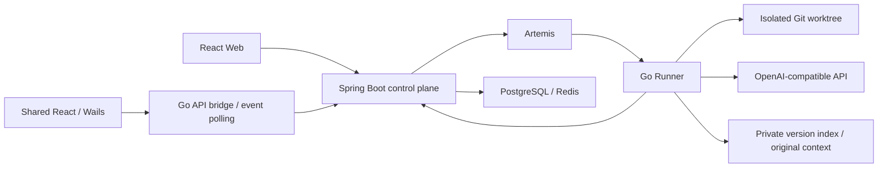

[简体中文](README.md) | [English](README.en.md) | [繁體中文](README.zh-TW.md) | [日本語](README.ja.md)

# ProofCode

ProofCode is a coding agent for verifiable changes: it reads repositories, generates patches, runs approved tools and tests, and produces changes that can be reviewed and recovered. It combines a Go agent engine, a Spring Boot control plane, a shared React web/desktop interface, and a Windows Wails application for everyday development workflows and undergraduate Computer Science research.

The workflow is **submit a goal → isolated worktree → tools and approval → patch → tests → artifact review → apply to the original checkout**.

## Conversation first development workspace

The default page is a clean conversation. Review has its own page, and each coding turn has a small link to its exact changes. Windows adds real Monaco editing with version checks and scoped drafts, a local command console, Git staging/commits/branches/remotes, structured merge review, standard LSP/DAP language services and breakpoint debugging, plus an isolated Edge/Chrome preview with the browser's bundled Chromium DevTools. Ordinary coding tasks can optionally use the browser tool; the fixed A–F experiment profiles are preserved.

[Operations, boundaries and reference projects](docs/developer-workspace.md) · [Structured merge and IDE protocols](docs/structured-merge-and-debugging.md) · [Visual data and review UI](docs/visual-data-and-review-ui.md) · [Verification record](docs/verification-structured-merge-2026-10-09.md)


## Versions and development status

This document describes the `codex/structured-merge-debug-tools` implementation branch, which has not been merged into `main`. The repository homepage still follows `main`; choose a version below and use that branch's documentation and configuration.

| Branch | Scope |
| --- | --- |
| [`main`](https://github.com/lgcyuzusakura/proofcode/tree/main) | Agent loop, tool approval, Git worktrees, recovery, artifacts, optional Jev routing, a web entry point, and a desktop UI prototype |
| [`codex/structured-merge-debug-tools`](https://github.com/lgcyuzusakura/proofcode/tree/codex/structured-merge-debug-tools) | Current: conversation first, dedicated review, Monaco IDE, real commands/browser, Git management, structured merge, LSP/DAP, and Chromium DevTools |
| [`codex/project-workspace-bootstrap`](https://github.com/lgcyuzusakura/proofcode/tree/codex/project-workspace-bootstrap) | Previous implementation: desktop projects, durable conversations, shared UI/API bridge, source snapshots and patch protection, project database/cache workbench, versioned RAG and original-context retrieval, A–F v2 comparisons |
| [`codex/backend-experiments-data-20261008`](https://github.com/lgcyuzusakura/proofcode/tree/codex/backend-experiments-data-20261008) | Earlier backend: project/workspace/conversation scope, four text retrieval routes, repeated-log deduplication, PostgreSQL/Redis gateway, A–F v1 comparisons, and CI |
| [`codex/thesis-ccu-20261008`](https://github.com/lgcyuzusakura/proofcode/tree/codex/thesis-ccu-20261008/thesis) | Evidence-backed undergraduate thesis draft, Word/PDF, bibliography, and reproduction materials |
| [`codex/project-data-context-plan-20261008`](https://github.com/lgcyuzusakura/proofcode/blob/codex/project-data-context-plan-20261008/docs/plans/2026-10-08-project-data-context-plan.md) | Plan and design choices preceding this implementation, retained as a design record |

The current implementation connects desktop projects, the data workbench, historical snapshot retrieval, and durable original-context reads. Retrieval uses deterministic indexes without embeddings. Engineering fixtures use mock model and Jev services; retrieval quality, hallucination rates, and speed benefits have not been measured on real model tasks and cannot be reported as thesis improvement results.

## Implemented on `main`

- OpenAI-compatible provider and tool calling, with step/usage budgets, cancellation, audit events, and a deterministic mock provider.
- Workspace file reads, paged file lists, `rg` search, structured patches, bounded commands, and Git diffs.
- An isolated Git worktree per task attempt, with checkpoints, complete messages, and recovery artifacts.
- Conditional Main, Scout, and Verifier coordination; Main is the only writer, while Scout and Verifier receive read-only tools.
- Optional Kev/Jev routing over a fixed tool candidate set; the generative model still supplies arguments.
- Spring Boot task APIs, database leases, cancellation/resume, WebSocket events, and a transactional PostgreSQL Outbox.
- A Go Runner consuming Artemis AMQP 1.0 tasks and reporting repository preparation, tool execution, and checkpoints.
- React project/task entry points, live events, approval/cancellation, an artifact timeline, and a Windows Wails desktop UI prototype with redacted configuration display.
- `proofcode-apply` checks the base revision and a clean checkout before applying a reviewed patch.
- Browser validation and MCP stdio libraries exist but are not connected to the Runner task loop.

## Current implementation branch

| Capability | Implemented behavior |
| --- | --- |
| Projects and conversations | Project → workspace → conversation → task ownership; conversations organized by project/folder, durable user/assistant messages, and separate chat and code execution modes. |
| Chat without an imported folder | Native Windows resolves the Desktop KnownFolder and creates `ProofCode-Projects/<name>_<UUID>` on the real Desktop. The bootstrap ID can be retried; absolute paths remain in the native registry. Web can create SCRATCH projects but cannot create a client Desktop directory. |
| Real source execution | Native folder import captures allowed current file bytes, including dirty and allowed untracked files. The control plane stores an immutable manifest; Runner verifies the queued hash and executes in an isolated worktree. Later Web SCRATCH code tasks reuse persisted source results. |
| Shared UI and transport | Web and Wails use the shared React workbench. Native `/api/` calls use the Go bridge, with durable event sequence polling. Web uses WebSocket and fetches persisted events after disconnects. |
| Review and apply | Real checkpoint/recovery diffs; native apply verifies the uploaded manifest, checks the patch in a temporary Git repository, validates paths and original file bytes, and stores a local apply journal and recovery records. |
| Versioned code RAG | Separate current-generation and explicitly selected historical-snapshot routes; `go/ast` for Go and labelled line-regex fallback elsewhere. Term/symbol/reference/test postings feed weighted RRF and coverage/budget selection, with file versions, hashes, and lines attached to evidence. |
| Retrievable compression | The complete transcript, tool JSON, and constraint ledger are persisted first. Log deduplication and budget selection keep complete protocol groups and `context_read` navigation. User requirements, errors, decisions, and data operations are protected; a protected input exceeding the budget fails explicitly. |
| Database and cache | Independent DataSession management sessions with project-scoped connections, schema, plans, audit, and recovery. PostgreSQL field drag/drop into a single-table query canvas, filters/sorting/paging, row editing, and bounded migrations. Redis string SCAN/GET/SET/DELETE/EXPIRE and TTL management. |

Reads, writes, and recovery follow **plan → preview → user approval → execute**; Runner auto-write flags do not bypass approval. Metadata inspection, connection validation, and read-only EXPLAIN may run before approval. Zero execution before approval refers to query-plan, mutation, and recovery execution. PostgreSQL transaction failures roll back; committed row edits and Redis keys use encrypted snapshots to create new conditional recovery plans requiring another approval. Unknown commit outcomes are not replayed automatically.

### Implementation limits

- PostgreSQL does not expose raw SQL, JOIN, aggregation, arbitrary functions, or stored procedures. Migration IR permits bounded table creation, nullable columns, and ordinary indexes; automatic inverse migrations after commit are not implemented.
- Redis currently supports standalone strings in a managed namespace, not Cluster, hash/list/set/zset, or arbitrary commands. Conditional recovery is not a transaction across stores.
- Historical RAG contains captured versions rather than all Git history. There are no embeddings, learned rerankers, or multilingual ASTs. Warm queries still verify and scan source bytes; accuracy and speed benefits remain unmeasured.
- Retaining originals does not make model comprehension lossless. Tokens are estimated from bytes and provider usage is recorded separately. Global user/Runner bearer tokens are not team RBAC or per-user project authorization.
- The apply journal supports recovery checks but does not guarantee an atomic multi-file filesystem transaction or prevent concurrent edits by external programs.

Details: [versioned context](docs/backend-context.md) · [data workbench and recovery](docs/backend-data.md) · [experiments and conversations](docs/backend-experiments.md).

## Quick start

Docker Desktop and Docker Compose are required. Real coding tasks also require a working OpenAI-compatible provider configuration.

```powershell
git clone --branch codex/structured-merge-debug-tools https://github.com/lgcyuzusakura/proofcode.git
cd proofcode
Copy-Item .env.example .env
```

Set `MODEL_BASE_URL`, `MODEL_NAME`, and `MODEL_API_KEY` in `.env`, along with your own `DEV_AUTH_TOKEN` and `RUNNER_TOKEN`. Then run:

```powershell
docker compose up --build
```

Runner uses the task's `model` field. The shared chat/code composer accepts any model ID supported by your provider; its three suggestions are hints. Changing `MODEL_NAME` in `.env` does not override task models. Displaying the redacted desktop Codex configuration does not transfer its API key to Runner; configure the execution service separately.

Open [http://localhost:3000](http://localhost:3000). Compose waits for PostgreSQL, Redis, Artemis, and the control plane to become healthy before starting dependent services.

The shared account settings store an access token; Web and native desktop use separate local storage. In Web, you can also open the developer tools Console, replace the placeholder below with `DEV_AUTH_TOKEN` from `.env`, and run:

```javascript
localStorage.setItem("proofcode.token", "<DEV_AUTH_TOKEN>");
location.reload();
```

For port conflicts, override `PROOFCODE_*_PORT` in `.env`, such as `PROOFCODE_WEB_PORT=3010` and `PROOFCODE_CONTROL_PORT=8090`.

### Windows desktop

The static preview requires Node.js/npm, Python 3, and Edge/Chrome. Native builds require Go, Wails 2.10.2, Git, and WebView2. The default tool directories are `.tools/go` and `.tools/bin`; override them with `PROOFCODE_GO_ROOT` and `PROOFCODE_WAILS_BIN`. Tools are not distributed with the repository. System Wails can also run `wails dev` or `wails build` inside `desktop/native/`.

```powershell
# Static desktop UI preview
.\desktop\start-desktop.ps1

# Native Wails application; requires Go/Wails
.\desktop\start-native.ps1

# Rebuild the native application
.\desktop\build-native.ps1

# Stop the static preview server
.\desktop\stop-desktop.ps1
```

Native desktop connects to control-plane APIs and polls durable events for real task progress. It does not start the control plane, broker, or Runner: start those services and enter `DEV_AUTH_TOKEN` in account settings. The native proxy defaults to `http://127.0.0.1:8080`; set `PROOFCODE_CONTROL_PLANE_URL` before starting the app to change it. Static preview shows the UI without native folder capabilities or an API proxy. See the [desktop entry point](desktop/README.md) and [native application](desktop/native/README.md).

### Tool approval and runtime

Writes and commands require approval by default. `RUNNER_ALLOW_WRITE=true` and `RUNNER_ALLOW_EXEC=true` enable automatic file writes and commands respectively; path, command, and cancellation checks still apply.

The Runner image contains Go 1.24, Node.js/npm/npx, Python 3/pytest, Git, and ripgrep. `RUNNER_ALLOWED_PROGRAMS` defines the executable allowlist. Extend the image and allowlist for Java, Rust, .NET, or other toolchains.

Git worktrees isolate changes. The current long-lived container does not provide complete per-task network or CPU/memory isolation. Authentication uses separate global user/Runner tokens without team RBAC or project membership permissions. See the [security model](docs/security.md).

## Optional Jev tool routing

Set `JEV_BASE_URL` for an existing TypeSafe-compatible service. `JEV_MODE=observe` records decisions while keeping all tools available. `JEV_MODE=route` narrows the tool set when confidence reaches `JEV_MIN_CONFIDENCE`. Normal tasks restore the full tool list on low confidence, invalid responses, or outages and record the event. Routing is off by default.

Jev does not generate arguments, grant approval, or bypass deterministic policy. `decision.tool_routed` records the actual decision; confidence is not measured accuracy. Groups C/F on the backend experiment branch require valid Jev routing and fail explicitly on configuration/service errors instead of silently becoming another group.

## Review and apply changes

Runner changes remain in an isolated worktree. After reviewing a `checkpoint` or `recovery` artifact, use a clean original checkout at the matching base revision:

```powershell
$env:PROOFCODE_AUTH_TOKEN = "<your-token>"
go -C agent-engine run ./cmd/proofcode-apply -url http://localhost:8080 -task "<task-id>" -repo "D:\path\to\checkout" -kind checkpoint
```

The command runs `git apply --check`, verifies the revision and checkout state, then applies unstaged changes. On the current development machine, the ignored `.tools/go/bin/go.exe` can be used when Go is not on PATH. The container image also includes `proofcode-apply`; mount the target checkout at `/repo` when using it.

The CLI above applies to a Git checkout baseline. Native local projects can approve application from the real diff review window. The uploaded file manifest and current bytes protect existing dirty changes without first committing them to a remote repository.

## Six-group comparisons and project data

The current branch uses the fixed `proofcode.experiment.v2-context` profile and provides six executable comparison groups:

| Group | Configuration |
| --- | --- |
| A | Plain LLM without Agent tools; an independent evaluator applies its final diff and tests it |
| B | LLM + tools + additional deterministic safety |
| C | LLM + tools + required Jev routing |
| D | LLM + tools + versioned hybrid code RAG |
| E | D + durable retrievable context compression |
| F | E + deterministic safety + required Jev + unresolved-failure feedback + project data tools |

Workspace, path, command, and data approval boundaries remain in every group. Algorithms and profiles differ between v1 and v2; do not combine them as one experiment batch. Obtain the current version in a separate directory:

```powershell
git clone --branch codex/structured-merge-debug-tools https://github.com/lgcyuzusakura/proofcode.git proofcode-backend
cd proofcode-backend
docker compose -f compose.experiments.yml up --build -d runner
docker compose -f compose.experiments.yml run --build --rm verify
docker compose -f compose.experiments.yml down --volumes --remove-orphans
```

The fixture uses isolated services and disposable databases without publishing host ports. A–F use a fixed source revision, separate tasks/worktrees, real patches, and a common test before exporting JSON/CSV. Reports are written to `.tools/experiment-e2e/`. This verifies engineering workflows; formal thesis comparisons require real responses and labeled tasks.

Connections store a `secretRef`, resolved by control-plane `DATA_SECRET_<reference>` environment variables. Compose provides `DATA_SECRET_PG_DEV` and `DATA_SECRET_REDIS_DEV`. PostgreSQL row mutations and Redis recovery snapshots need `DATA_SNAPSHOT_KEY`, a Base64 encoding of 32 random bytes. Keep real credentials and test keys out of the public repository.

Details: [experiments and sessions](docs/backend-experiments.md) · [retrieval and compression](docs/backend-context.md) · [data gateway](docs/backend-data.md).

## Architecture and layout



| Directory | Contents |
| --- | --- |
| `agent-engine/` | Go agent, Runner, tools, worktrees, browser, and MCP |
| `control-plane/` | Java control plane, task state, approvals, and reliable dispatch |
| `frontend/` | Shared React UI and web application |
| `desktop/` | Wails native app, API bridge, folder registry, snapshots, and patch application |
| `protocol/` | Versioned message and event contracts |
| `compose*.yml` | Container startup, test, and integration configurations |
| `docs/` | Architecture, security, acceptance, and branch-specific documentation |

[Architecture](docs/architecture.md) · [Security model](docs/security.md) · [Acceptance targets](docs/acceptance.md). Performance targets in the acceptance document are development goals, not measured benchmarks.

## Development checks

Run the three checks separately so one container exiting does not stop the others:

```powershell
docker compose -f compose.test.yml run --rm agent-test
docker compose -f compose.test.yml run --rm control-test
docker compose -f compose.test.yml run --rm frontend-test
```

Unit and contract checks need no model key. The current branch includes GitHub Actions for Go/Java/frontend checks and the six-group service fixture. Live PostgreSQL/Redis adapter tests require separate disposable instances; see the data documentation.

`compose.smoke.yml` provides an end-to-end fixture with a mock streaming provider: it creates source files, runs real tests, and produces checkpoints. It verifies service wiring, not model quality. Real tasks use the configured generative provider.
