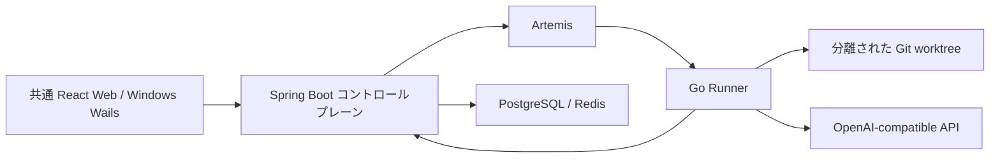

[简体中文](README.md) | [English](README.en.md) | [繁體中文](README.zh-TW.md) | [日本語](README.ja.md)

# ProofCode

ProofCode は、検証可能なコード変更を行うプログラミング Agent です。リポジトリを読み取り、パッチを生成し、承認されたツールとテストを実行して、レビューと復旧が可能な変更成果物を提供します。Go Agent、Spring Boot コントロールプレーン、共通 React Web／Windows Wails インターフェースを使用します。

基本の流れは、**目標の送信 → 分離された作業ツリー → ツールと承認 → コードパッチ → テストによる検証 → 成果物のレビュー → 元のリポジトリへの適用**です。

## バージョンと開発状況

本文は `codex/project-workspace-bootstrap` 実装ブランチに対応します。まだ `main` に統合されていません。ブランチごとのドキュメントと設定を使用してください。

| ブランチ | 公開されている内容 |
| --- | --- |
| [`main`](https://github.com/lgcyuzusakura/proofcode/tree/main) | Agent のメインループ、ツール承認、Git worktree、タスクの復旧、変更成果物、任意の Jev ルーティング、Web 入口とデスクトップ UI のプロトタイプ |
| [`codex/project-workspace-bootstrap`](https://github.com/lgcyuzusakura/proofcode/tree/codex/project-workspace-bootstrap) | デスクトップ工程、永続会話、共通 UI／API 代理、ソーススナップショット、データベース／キャッシュ管理、バージョン別 RAG と復元可能な圧縮、A–F v2 比較 |
| [`codex/backend-experiments-data-20261008`](https://github.com/lgcyuzusakura/proofcode/tree/codex/backend-experiments-data-20261008) | プロジェクト・ワークスペース・会話のスコープ、4 系統のコード検索、重複ログの圧縮、PostgreSQL/Redis データゲートウェイ、実行可能な A–F 比較、CI |
| [`codex/thesis-ccu-20261008`](https://github.com/lgcyuzusakura/proofcode/tree/codex/thesis-ccu-20261008/thesis) | 出典と実装の証拠に基づく学部卒業論文の初稿、Word/PDF、参考文献、再現用資料 |
| [`codex/project-data-context-plan-20261008`](https://github.com/lgcyuzusakura/proofcode/blob/codex/project-data-context-plan-20261008/docs/plans/2026-10-08-project-data-context-plan.md) | デスクトップ上でのプロジェクト自動作成、データベース・キャッシュの可視化管理、過去の複数バージョンを扱う RAG、再取得可能なコンテキストの実装計画 |

このブランチでは、工程ごとの永続会話、PostgreSQL／Redis の可視化管理、Windows デスクトップ工程の自動作成、複数バージョンの検索を実装しています。検索は embedding を使わない重み付き分層 RRF と Go AST（他言語はテキスト）です。圧縮した原文はハッシュ参照で再取得できます。トークン数は推定です。6 グループの結合テストのモデルと Jev は固定フィクスチャであり、実際のモデル性能や論文の改善結果を示すものではありません。

## `main` に実装済みの機能

- OpenAI-compatible インターフェースとツール呼び出し。メインループはステップ数・使用量の予算、キャンセル、監査イベント、決定的なモックインターフェースに対応しています。
- ワークスペース内のファイル読み取り、ページ分割されたファイル一覧、`rg` 検索、構造化パッチ、制限付きコマンド、Git diff。
- タスクの各 attempt に独立した Git worktree を使用し、チェックポイント、完全なメッセージ履歴、復旧成果物を保存します。
- 条件に応じた Main、Scout、Verifier の協調。ファイルを変更できるのは Main だけで、Scout と Verifier は読み取り専用ツールを使用します。
- 固定された候補集合からツールを選ぶ、任意の Kev/Jev ルーティング。ツールの引数は引き続き生成モデルが提供します。
- Spring Boot のタスク API、データベース上のリース管理、キャンセル・再開、WebSocket イベント、PostgreSQL のトランザクション Outbox。
- Go Runner が Artemis AMQP 1.0 経由でタスクを受け取り、リポジトリの準備、ツール実行、チェックポイントのコールバックを行います。
- React Web のプロジェクト・タスク入口、リアルタイムイベント、承認・キャンセル、タスク成果物のタイムライン。Windows 向け Wails デスクトップ UI のプロトタイプと、機密情報を伏せた設定表示。
- `proofcode-apply` はレビュー後にベース revision とクリーンな作業ディレクトリを確認してから、パッチを適用します。
- ブラウザー検証ライブラリと MCP stdio クライアントは存在しますが、Runner のタスクメインループにはまだ接続されていません。

## クイックスタート

Docker Desktop と Docker Compose が必要です。実際のプログラミングタスクには、利用可能な OpenAI-compatible インターフェースの設定も必要です。

```powershell
git clone https://github.com/lgcyuzusakura/proofcode.git
cd proofcode
git switch codex/project-workspace-bootstrap
Copy-Item .env.example .env
```

`.env` に `MODEL_BASE_URL`、`MODEL_NAME`、`MODEL_API_KEY` を設定し、自分用の `DEV_AUTH_TOKEN` と `RUNNER_TOKEN` も設定します。その後、次を実行します。

```powershell
docker compose up --build
```

Runner はタスクの `model` フィールドを使用します。Web のモデル ID 入力にはサービス提供者がサポートする ID を指定してください。`.env` の `MODEL_NAME` だけではタスクのモデルは上書きされません。

[http://localhost:3000](http://localhost:3000) を開きます。Compose は PostgreSQL、Redis、Artemis、コントロールプレーンが正常になるのを待ってから、依存サービスを起動します。

画面のアカウント設定に `.env` の `DEV_AUTH_TOKEN` を保存します。ブラウザーのストレージからも設定できます。

```javascript
localStorage.setItem("proofcode.token", "<DEV_AUTH_TOKEN>");
location.reload();
```

ポートが競合する場合は、`.env` の `PROOFCODE_*_PORT` を上書きします。例：`PROOFCODE_WEB_PORT=3010`、`PROOFCODE_CONTROL_PORT=8090`。

### Windows デスクトップ

静的プレビューには Node.js/npm、Python 3、Edge/Chrome が必要です。ネイティブビルドのスクリプトは `.tools/bin/wails.exe` を直接呼び出し、`.tools/go/bin/go.exe` を優先します。これらのツールはリポジトリに含まれていないため、ローカルのツールと WebView2 を先に用意してください。別の方法として、システムに Wails 2.10.2 をインストールし、`desktop/native/` 内で `wails dev` または `wails build` を実行できます。

```powershell
# 静的なデスクトップ UI のプレビュー
.\desktop\start-desktop.ps1

# ネイティブ Wails アプリケーション。Go/Wails 環境が必要
.\desktop\start-native.ps1

# ネイティブアプリケーションの再ビルド
.\desktop\build-native.ps1

# 静的プレビューサーバーの停止
.\desktop\stop-desktop.ps1
```

ネイティブ版は Web と同じ UI を使い、許可された HTTP API を Go 代理経由でコントロールプレーンに接続します。イベントはポーリングで同期します。フォルダー未選択の会話は Windows Known Folder の Desktop 配下に工程を作成し、本機パスは端末だけで保持します。ローカルソースは相対パス・ハッシュ付きで送信し、適用時に排他的ファイルハンドルで原文を再確認します。詳細は[デスクトップ入口](desktop/README.md)と[ネイティブアプリケーション](desktop/native/README.md)を参照してください。

### ツール承認と実行環境

デフォルトではファイル書き込みとコマンド実行に承認が必要です。`RUNNER_ALLOW_WRITE=true` と `RUNNER_ALLOW_EXEC=true` は、それぞれファイル書き込みとコマンド実行の自動化を許可します。パス、コマンド、キャンセルのチェックは引き続き適用されます。

Runner イメージには Go 1.24、Node.js/npm/npx、Python 3/pytest、Git、ripgrep が含まれています。`RUNNER_ALLOWED_PROGRAMS` で実行可能プログラムの許可リストを設定します。Java、Rust、.NET などのツールチェーンが必要な場合は、イメージと許可リストを拡張してください。

Git worktree は変更を分離します。現在の長時間稼働するコンテナーは、タスクごとのネットワークや CPU・メモリーの完全な分離を提供していません。チームメンバーの RBAC も今後の開発項目です。現在の境界は[セキュリティモデル](docs/security.md)を参照してください。

## 任意の Jev ツールルーティング

既存の TypeSafe-compatible サービスを利用する場合は、`JEV_BASE_URL` を設定します。`JEV_MODE=observe` は、すべてのツールを利用可能なまま決定を記録します。`JEV_MODE=route` は、信頼度が `JEV_MIN_CONFIDENCE` に達すると、そのステップのツール集合を絞り込みます。通常のタスクでは、信頼度が低い場合、不正な応答の場合、サービスが利用できない場合に、すべてのツールへフォールバックし、そのイベントを記録します。ルーティングはデフォルトで無効です。

Jev はツールの引数を生成せず、操作を承認せず、決定的なポリシーを回避できません。`decision.tool_routed` イベントに実際の選択根拠を記録します。信頼度は実測の正解率ではありません。バックエンド実験ブランチの C/F グループでは、有効な Jev ルーティングが必須です。設定やサービスのエラーがあれば明示的に失敗し、別のグループへ黙って切り替わることはありません。

## 変更のレビューと適用

Runner の変更は分離された作業ツリー内にあります。`checkpoint` または `recovery` 成果物をレビューした後、ベース revision が一致する、クリーンな元のリポジトリで次を実行します。

```powershell
$env:PROOFCODE_AUTH_TOKEN = "<your-token>"
go -C agent-engine run ./cmd/proofcode-apply -url http://localhost:8080 -task "<task-id>" -repo "D:\path\to\checkout" -kind checkpoint
```

このコマンドは `git apply --check` を実行し、revision と作業ディレクトリの状態を確認してから、未ステージの変更としてパッチを適用します。現在の開発マシンでシステムの Go が設定されていない場合は、Git の追跡対象外である `.tools/go/bin/go.exe` を使用できます。コンテナーイメージにも `proofcode-apply` が含まれており、対象リポジトリを `/repo` にマウントして実行できます。

## 6 グループの比較とプロジェクトデータ機能

この実装ブランチで A–F の独立タスクを実行し、同一の commit とテストコマンドで比較できます。

```powershell
git clone --branch codex/project-workspace-bootstrap https://github.com/lgcyuzusakura/proofcode.git proofcode-backend
cd proofcode-backend
docker compose -f compose.experiments.yml up --build -d runner
docker compose -f compose.experiments.yml run --build --rm verify
docker compose -f compose.experiments.yml down --volumes --remove-orphans
```

テスト用フィクスチャは独立したサービスと使い捨てのデータベースを使用し、ホストのポートを公開しません。A–F は固定されたソース revision、独立したタスクと作業ツリー、実際のパッチ、共通のテストを使用し、JSON/CSV を出力します。レポートは `.tools/experiment-e2e/` に保存されます。これは実装の処理経路を検証するもので、正式な論文の比較実験には実際の応答とラベル付きタスクセットが必要です。

PostgreSQL/Redis のデータ操作には、Runner の自動書き込み・実行を有効にしていても、明示的なユーザー承認が必要です。認証情報はコントロールプレーンに保持します。PostgreSQL のトランザクション失敗時のロールバックと、Redis の条件付き補償は別の仕組みです。対象のコミット結果が不明な場合は、自動で再実行しません。

詳細：[実験と会話](docs/backend-experiments.md) · [検索と圧縮](docs/backend-context.md) · [データゲートウェイ](docs/backend-data.md)。PostgreSQL は型付き単一テーブル IR（JOIN／集約なし）、Redis は standalone string に対応します。行／キーの復旧は条件付き補償を新規承認して実行します。コミット済み migration の汎用逆変換は提供しません。

## アーキテクチャとディレクトリ構成



| ディレクトリ | 内容 |
| --- | --- |
| `agent-engine/` | Go Agent、Runner、ツール、作業ツリー、ブラウザー、MCP |
| `control-plane/` | Java コントロールプレーン、タスク状態、承認、信頼性のあるディスパッチ |
| `frontend/` | 共有 React インターフェースと Web アプリケーション |
| `desktop/` | Windows Wails、工程登録、API 代理、ソース確認と適用復旧 |
| `protocol/` | バージョン管理されたメッセージとイベントの契約 |
| `compose*.yml` | コンテナ起動、テスト、結合検証の設定 |
| `docs/` | アーキテクチャ、セキュリティ、受け入れ基準、各ブランチの専用ドキュメント |

[アーキテクチャ](docs/architecture.md) · [セキュリティモデル](docs/security.md) · [受け入れ目標](docs/acceptance.md)。受け入れ文書の性能目標は開発目標であり、測定済みのベンチマーク結果ではありません。

## 開発時の検証

1 つのコンテナーの終了でほかのチェックが中断されないよう、3 つのチェックを個別に実行します。

```powershell
docker compose -f compose.test.yml run --rm agent-test
docker compose -f compose.test.yml run --rm control-test
docker compose -f compose.test.yml run --rm frontend-test
```

単体テストと契約チェックにはモデルの key は不要です。バックエンドブランチには、Go/Java/フロントエンドのチェックと、6 グループのサービス結合テストを実行する GitHub Actions ワークフローも含まれています。

`compose.smoke.yml` はモックのストリーミングインターフェースを使用したエンドツーエンドの結合テストを提供します。テスト用ソースを作成し、実際のテストを実行して、チェックポイントを出力します。これはサービス間の接続を検証するもので、モデル能力を評価するものではありません。実際のタスクは設定された生成インターフェースを使用します。
