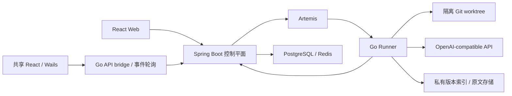

[简体中文](README.md) | [English](README.en.md) | [繁體中文](README.zh-TW.md) | [日本語](README.ja.md)

# ProofCode

ProofCode 是面向可验证代码修改的编程 Agent：读取仓库、生成补丁、执行经过批准的工具、运行测试，并交付可以审阅和恢复的修改产物。项目使用 Go Agent 引擎、Spring Boot 控制平面、共享 React Web/桌面界面和 Windows Wails 应用，服务于日常开发工作流与计算机专业毕业设计研究。

核心流程是：**提交目标 → 隔离工作树 → 工具与批准 → 代码补丁 → 测试验证 → 审阅产物 → 应用到原仓库**。

## 对话优先的开发界面

默认进入干净的对话页；审查是独立页面，每个代码回合用小型“查看修改”按钮准确跳转。Windows 桌面端增加真实 Monaco 编辑、版本核对保存与工程草稿恢复、本机命令控制台、Git 暂存/提交/分支/远程管理、结构化合并审查、标准 LSP/DAP 语言服务与断点调试，以及可点击输入和完整 Chromium DevTools 的独立 Edge/Chrome 预览。普通代码任务可选启用浏览器验证工具，A–F 对照配置保持固定。

[操作、实现边界与参考项目](docs/developer-workspace.md) · [结构化合并与 IDE 协议说明](docs/structured-merge-and-debugging.md) · [本轮验收记录](docs/verification-structured-merge-2026-10-09.md)


## 版本与开发状态

本文对应 `codex/structured-merge-debug-tools` 实现分支，该分支尚未合并到 `main`。仓库首页仍对应 `main`；请按下表选择版本，并使用该分支的文档和配置。

| 分支 | 内容范围 |
| --- | --- |
| [`main`](https://github.com/lgcyuzusakura/proofcode/tree/main) | 编程 Agent 主循环、工具批准、Git worktree、任务恢复、修改产物、可选 Jev 路由、Web 入口与桌面界面原型 |
| [`codex/structured-merge-debug-tools`](https://github.com/lgcyuzusakura/proofcode/tree/codex/structured-merge-debug-tools) | 当前实现：对话优先、独立回合审查、Monaco IDE、真实命令/浏览器、Git 管理；提供结构化合并、LSP/DAP 和 Chromium DevTools |
| [`codex/project-workspace-bootstrap`](https://github.com/lgcyuzusakura/proofcode/tree/codex/project-workspace-bootstrap) | 前一实现：桌面工程与持久对话、共享 UI/API 代理、源码快照与补丁保护、项目数据库/缓存工作台、版本化 RAG/原文回取、A–F v2 对照 |
| [`codex/backend-experiments-data-20261008`](https://github.com/lgcyuzusakura/proofcode/tree/codex/backend-experiments-data-20261008) | 早期后端版本：项目/工作区/对话作用域、四路文本检索、重复日志去重、PostgreSQL/Redis 数据网关、A–F v1 对照及 CI |
| [`codex/thesis-ccu-20261008`](https://github.com/lgcyuzusakura/proofcode/tree/codex/thesis-ccu-20261008/thesis) | 有来源与工程证据的本科毕业设计论文初稿、Word/PDF、参考文献与复现材料 |
| [`codex/project-data-context-plan-20261008`](https://github.com/lgcyuzusakura/proofcode/blob/codex/project-data-context-plan-20261008/docs/plans/2026-10-08-project-data-context-plan.md) | 本轮开发之前的方案与设计取舍，保留为设计记录 |

当前实现分支已经接通桌面工程、数据工作台、历史快照检索与持久上下文回取。检索使用确定性索引，没有 embedding。工程联调中的模型与 Jev 使用模拟服务，检索率、幻觉率和速度收益尚未通过真实模型任务集测量，不能写成论文提升数据。

## `main` 已实现的能力

- OpenAI-compatible 接口与工具调用；主循环支持步骤/用量预算、取消、审计事件和确定性模拟接口。
- 工作区内的文件读取、分页文件列表、`rg` 搜索、结构化补丁、受限命令与 Git diff。
- 每个任务 attempt 使用独立 Git worktree，保存检查点、完整消息及恢复产物。
- 条件式 Main、Scout、Verifier 协作；只有 Main 能修改文件，Scout/Verifier 使用只读工具。
- 可选 Kev/Jev 固定候选工具路由；它负责选择工具，工具参数仍由生成模型提供。
- Spring Boot 任务 API、数据库租约、取消/恢复、WebSocket 事件及 PostgreSQL 事务 Outbox。
- Go Runner 通过 Artemis AMQP 1.0 领取任务，执行仓库准备、工具和检查点回调。
- React Web 项目/任务入口、实时事件、批准与取消、任务产物时间线；Windows Wails 桌面界面原型与脱敏配置展示。
- `proofcode-apply` 在审阅后校验基线 revision 和干净工作区，再应用补丁。
- 浏览器验证库与 MCP stdio 客户端已存在，尚未接入 Runner 任务主循环。

## 当前实现分支

| 能力 | 实际实现 |
| --- | --- |
| 项目与对话 | 项目 → 工作区 → 对话 → 任务归属链；按项目/目录切换对话，持久保存用户与助手消息；普通聊天与代码任务分开执行。 |
| 无目录聊天 | 原生 Windows 桌面通过 Desktop KnownFolder 在真实桌面的 `ProofCode-Projects/<名称>_<UUID>` 创建工程；同一 bootstrap ID 可重试，路径仅保存在本机注册表。Web 可创建 SCRATCH 项目，但不能创建客户端桌面目录。 |
| 真实源码执行 | 原生端导入本地目录，捕获允许的当前文件字节，包括 dirty 和允许的未追踪文件；控制平面保存不可变 manifest，Runner 核对入队哈希后在隔离工作树执行。Web SCRATCH 的后续代码任务使用已保存的源码结果。 |
| 共享界面与传输 | Web 与 Wails 使用共享 React 工作台；原生 `/api/` 调用通过 Go bridge 访问控制平面，按持久事件序号轮询。Web 使用 WebSocket，并在断线时补取持久事件。 |
| 修改审阅与应用 | 展示真实 checkpoint/recovery diff；本地应用先核对原快照 manifest，在临时 Git 仓库验证补丁，检查目标路径及逐文件原字节，并保存本机应用日志与恢复记录。 |
| 多版本代码 RAG | 当前 generation 与显式历史 snapshot 分开查询；Go 使用 `go/ast`，其他语言明确回退到 line-regex；词项/符号/引用/测试倒排索引经带权 RRF 和覆盖预算选择，证据绑定文件版本、哈希和行号。 |
| 可回取压缩 | 原 transcript、工具 JSON 与约束台账先持久化；成功日志去重和完整协议组预算裁剪后保留 `context_read` 导航。全部用户要求、错误、批准/拒绝与 data 操作受保护，超预算明确失败。 |
| 数据库与缓存 | 独立 DataSession 管理会话；连接、结构、计划、审计和恢复按项目隔离。PostgreSQL 字段拖入单表查询画布、条件/排序/分页、结果编辑与受限迁移；Redis string 的 SCAN/GET/SET/DELETE/EXPIRE 与 TTL 管理。 |

数据读取、写入和恢复都经过“计划 → 预览 → 用户批准 → 执行”，普通任务的自动写入开关不能绕过。元数据检查、连接验证和只读 EXPLAIN 可在批准前进行；“批准前零执行”指查询计划、写入及恢复执行。PostgreSQL 事务内失败自动回滚；已提交行修改和 Redis 键通过加密快照生成新的条件恢复计划，必须再次批准。未知提交结果不自动重放。

### 实现边界

- PostgreSQL 尚不支持原始 SQL、JOIN、聚合、任意函数和存储过程；迁移仅开放受限建表、可空列和普通索引，尚无已提交迁移的通用自动 inverse。
- Redis 当前是 standalone 的受控命名空间 string 操作，不支持 Cluster、hash/list/set/zset 或任意命令；条件恢复不能替代跨数据库事务。
- 历史 RAG 只保存被系统捕获的版本，不会自动导入全部 Git 历史；没有 embedding、学习式重排或多语言 AST。热查询仍核验并扫描源码，尚未证明速度或准确率优势。
- 压缩保留原文不代表模型理解无损；Token 基于字节估算，真实 usage 单独记录。全局用户/Runner bearer token 不是团队 RBAC 或逐用户项目授权。
- 补丁应用日志支持恢复检查，但不能保证多文件写入的操作系统级原子性，也不能阻止外部程序同时改文件。

专项说明：[版本检索与上下文](docs/backend-context.md) · [数据工作台与恢复](docs/backend-data.md) · [实验与会话](docs/backend-experiments.md)。

## 快速启动

需要 Docker Desktop 与 Docker Compose。真实编程任务还需要可用的 OpenAI-compatible 接口配置。

```powershell
git clone --branch codex/structured-merge-debug-tools https://github.com/lgcyuzusakura/proofcode.git
cd proofcode
Copy-Item .env.example .env
```

在 `.env` 中设置 `MODEL_BASE_URL`、`MODEL_NAME`、`MODEL_API_KEY`，并设置自己的 `DEV_AUTH_TOKEN` 与 `RUNNER_TOKEN`。然后运行：

```powershell
docker compose up --build
```

当前 Runner 使用任务的 `model` 字段。共享聊天/代码任务输入框接受服务提供方支持的任意模型 ID，三个建议项仅是提示。仅修改 `.env` 的 `MODEL_NAME` 不会覆盖任务模型。桌面显示的 Codex 脱敏配置不会把 API key 自动传给 Runner；仍需单独配置执行服务。

打开 [http://localhost:3000](http://localhost:3000)。Compose 会等待 PostgreSQL、Redis、Artemis 和控制平面健康后再启动依赖服务。

共享界面的账户设置可保存访问令牌，Web 与原生桌面各自使用本地存储。Web 也可打开开发者工具的 Console，将下面的占位符替换为 `.env` 中的 `DEV_AUTH_TOKEN` 后执行：

```javascript
localStorage.setItem("proofcode.token", "<DEV_AUTH_TOKEN>");
location.reload();
```

端口冲突时，在 `.env` 中覆盖 `PROOFCODE_*_PORT`，例如 `PROOFCODE_WEB_PORT=3010`、`PROOFCODE_CONTROL_PORT=8090`。

### Windows 桌面

静态预览需要 Node.js/npm、Python 3 和 Edge/Chrome。原生构建需要 Go、Wails 2.10.2、Git 和 WebView2；默认工具目录为 `.tools/go` 与 `.tools/bin`，也可设置 `PROOFCODE_GO_ROOT` 和 `PROOFCODE_WAILS_BIN`。工具未随仓库分发。也可用系统 Wails 在 `desktop/native/` 内运行 `wails dev` 或 `wails build`。

```powershell
# 静态桌面界面预览
.\desktop\start-desktop.ps1

# 原生 Wails 应用，依赖 Go/Wails 环境
.\desktop\start-native.ps1

# 重建原生应用
.\desktop\build-native.ps1

# 停止静态预览服务器
.\desktop\stop-desktop.ps1
```

原生桌面已接通控制平面 API，并通过持久事件轮询读取真实任务进度；它不会自行启动控制平面、消息队列或 Runner。启动这些服务，并在账户设置中填写 `DEV_AUTH_TOKEN`。原生代理默认连接 `http://127.0.0.1:8080`，启动应用前可用 `PROOFCODE_CONTROL_PLANE_URL` 改地址。静态预览只展示 UI，没有原生目录能力或控制平面代理。详细说明见 [桌面入口](desktop/README.md) 和 [原生应用](desktop/native/README.md)。

### 工具批准与运行环境

默认写文件和执行命令需要批准。`RUNNER_ALLOW_WRITE=true`、`RUNNER_ALLOW_EXEC=true` 分别允许自动文件写入与命令执行；它们不改变路径、命令和取消检查。

Runner 镜像包含 Go 1.24、Node.js/npm/npx、Python 3/pytest、Git 和 ripgrep。`RUNNER_ALLOWED_PROGRAMS` 配置可执行程序白名单；需要 Java、Rust、.NET 等工具链时扩展镜像和白名单。

Git worktree 提供修改隔离；当前长期运行的容器还没有完整的每任务网络、CPU/内存隔离。身份认证使用独立全局用户/Runner token，尚无团队成员 RBAC 或项目成员权限。现有边界见 [安全模型](docs/security.md)。

## 可选 Jev 工具路由

配置现有 TypeSafe-compatible 服务的 `JEV_BASE_URL`。`JEV_MODE=observe` 记录决策并保留全部工具；`JEV_MODE=route` 在置信度达到 `JEV_MIN_CONFIDENCE` 时限制本轮工具集合。普通任务遇到低置信度、非法响应或服务不可用时回退完整工具列表，并记录事件。默认未开启路由。

Jev 不生成工具参数、不批准操作，也不能绕过确定性策略。事件 `decision.tool_routed` 保留实际选择依据；置信度不等于实测正确率。后端实验分支的 C/F 组要求有效 Jev 路由，配置或服务失败时明确失败，不会静默变成另一组。

## 审阅并应用修改

Runner 的修改位于隔离工作树。审阅 `checkpoint` 或 `recovery` 产物后，针对基线 revision 一致且干净的原仓库执行：

```powershell
$env:PROOFCODE_AUTH_TOKEN = "<your-token>"
go -C agent-engine run ./cmd/proofcode-apply -url http://localhost:8080 -task "<task-id>" -repo "D:\path\to\checkout" -kind checkpoint
```

命令先执行 `git apply --check`，核对 revision 与工作区状态，通过后应用为未暂存修改。当前开发机若未配置系统 Go，可使用被忽略的 `.tools/go/bin/go.exe`；容器镜像也提供 `proofcode-apply`，可挂载目标仓库到 `/repo` 后调用。

上述 CLI 适用于 Git 仓库基线。当前原生本地工程可在真实 diff 审阅窗口中批准应用，通过上传时的文件 manifest 与当前字节核验来保护已有 dirty 修改；它不要求先把这些修改提交到远程仓库。

## 六组比较与项目数据能力

当前分支使用固定配置版本 `proofcode.experiment.v2-context`，提供可实际运行的六组对照：

| 组 | 配置 |
| --- | --- |
| A | 纯 LLM，Agent 无工具；独立 evaluator 应用其最终 diff 并测试 |
| B | LLM + 工具 + 额外确定性安全策略 |
| C | LLM + 工具 + 必需 Jev 路由 |
| D | LLM + 工具 + 版本化混合代码 RAG |
| E | D + 持久可回取上下文压缩 |
| F | E + 确定性安全策略 + 必需 Jev + 未解决失败反馈 + 项目数据工具 |

全部组保留工作区、路径、命令和数据批准底线。v1 与 v2 的算法和配置不同，不应混成同一批实验。可在独立目录取得当前版本：

```powershell
git clone --branch codex/structured-merge-debug-tools https://github.com/lgcyuzusakura/proofcode.git proofcode-backend
cd proofcode-backend
docker compose -f compose.experiments.yml up --build -d runner
docker compose -f compose.experiments.yml run --build --rm verify
docker compose -f compose.experiments.yml down --volumes --remove-orphans
```

夹具使用独立服务与可销毁数据库，不发布宿主端口。A–F 使用固定源码版本、独立任务与工作树、真实补丁和统一测试，再导出 JSON/CSV。报告写入 `.tools/experiment-e2e/`；这是工程链路验证，正式论文对比需要真实响应与标注任务集。

数据连接保存 `secretRef`，凭据由控制平面的 `DATA_SECRET_<引用>` 环境变量解析。Compose 提供 `DATA_SECRET_PG_DEV` 与 `DATA_SECRET_REDIS_DEV`；PostgreSQL 行修改和 Redis 恢复快照需要 `DATA_SNAPSHOT_KEY`（32 字节随机密钥的 Base64）。不能把测试密钥或真实凭据写进公开仓库。

详细文档：[实验与会话](docs/backend-experiments.md) · [检索与压缩](docs/backend-context.md) · [数据网关](docs/backend-data.md)。

## 架构与目录



| 目录 | 内容 |
| --- | --- |
| `agent-engine/` | Go Agent、Runner、工具、工作树、浏览器与 MCP |
| `control-plane/` | Java 控制平面、任务状态、批准与可靠派发 |
| `frontend/` | 共享 React 界面与 Web 应用 |
| `desktop/` | Wails 原生工程、API 代理、目录注册、快照与补丁应用 |
| `protocol/` | 版本化消息和事件契约 |
| `compose*.yml` | 容器启动、测试与联调配置 |
| `docs/` | 架构、安全、验收及各分支专项文档 |

[架构说明](docs/architecture.md) · [安全模型](docs/security.md) · [验收目标](docs/acceptance.md)。验收文档中的性能目标是开发目标，不是已测量的基准结果。

## 开发验证

分别运行三个检查，避免一个容器先退出后中止其他检查：

```powershell
docker compose -f compose.test.yml run --rm agent-test
docker compose -f compose.test.yml run --rm control-test
docker compose -f compose.test.yml run --rm frontend-test
```

单元与契约检查不需要模型 key。当前分支包含 GitHub Actions 的 Go/Java/前端检查和六组服务联调工作流。真实 PostgreSQL/Redis 适配器测试需要单独的可销毁实例，配置见数据文档。

`compose.smoke.yml` 提供模拟流式接口的端到端联调：创建测试源码、运行真实测试并产出检查点。它验证服务接线，不评价模型能力。真实任务仍使用配置的生成接口。
