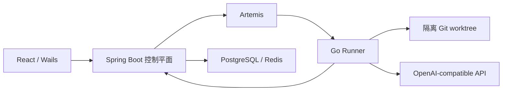

[简体中文](README.md) | [English](README.en.md) | [繁體中文](README.zh-TW.md) | [日本語](README.ja.md)

# ProofCode

ProofCode 是面向可验证代码修改的编程 Agent：读取仓库、生成补丁、执行经过批准的工具、运行测试，并交付可以审阅和恢复的修改产物。项目使用 Go Agent 引擎、Spring Boot 控制平面、React Web 界面和 Windows Wails 桌面壳，服务于日常开发工作流与计算机专业毕业设计研究。

核心流程是：**提交目标 → 隔离工作树 → 工具与批准 → 代码补丁 → 测试验证 → 审阅产物 → 应用到原仓库**。

## 版本与开发状态

仓库首页对应 `main`。新增能力分别保存在独立开发分支；切换分支时请使用对应分支的文档和配置。

| 分支 | 已发布内容 |
| --- | --- |
| [`main`](https://github.com/lgcyuzusakura/proofcode/tree/main) | 编程 Agent 主循环、工具批准、Git worktree、任务恢复、修改产物、可选 Jev 路由及 Web/桌面入口 |
| [`codex/backend-experiments-data-20261008`](https://github.com/lgcyuzusakura/proofcode/tree/codex/backend-experiments-data-20261008) | 项目/工作区/对话作用域、四路代码检索、重复日志压缩、PostgreSQL/Redis 数据网关、可运行 A–F 对照及 CI |
| [`codex/thesis-ccu-20261008`](https://github.com/lgcyuzusakura/proofcode/tree/codex/thesis-ccu-20261008/thesis) | 有来源与工程证据的本科毕业设计论文初稿、Word/PDF、参考文献与复现材料 |
| [`codex/project-data-context-plan-20261008`](https://github.com/lgcyuzusakura/proofcode/blob/codex/project-data-context-plan-20261008/docs/plans/2026-10-08-project-data-context-plan.md) | 自动桌面工程、可视化数据库/缓存、多版本 RAG 与可回取上下文的后续实施方案 |

可视化数据库/缓存管理、无目录对话自动创建桌面工程、历史多版本检索属于后续开发。后端分支目前使用确定性检索，未配置 embedding；上下文压缩主要去重重复成功日志。六组联调中的模型与 Jev 响应是模拟夹具，不能当作真实模型性能或论文提升数据。

## `main` 已实现的能力

- OpenAI-compatible 接口与工具调用；主循环支持步骤/用量预算、取消、审计事件和确定性模拟接口。
- 工作区内的文件读取、分页文件列表、`rg` 搜索、结构化补丁、受限命令与 Git diff。
- 每个任务 attempt 使用独立 Git worktree，保存检查点、完整消息及恢复产物。
- 条件式 Main、Scout、Verifier 协作；只有 Main 能修改文件，Scout/Verifier 使用只读工具。
- 可选 Kev/Jev 固定候选工具路由；它负责选择工具，工具参数仍由生成模型提供。
- Spring Boot 任务 API、数据库租约、取消/恢复、WebSocket 事件及 PostgreSQL 事务 Outbox。
- Go Runner 通过 Artemis AMQP 1.0 领取任务，执行仓库准备、工具和检查点回调。
- React Web 项目/任务入口、实时事件、批准与取消、任务产物时间线；Windows Wails 桌面入口。
- `proofcode-apply` 在审阅后校验基线 revision 和干净工作区，再应用补丁。
- 浏览器验证库与 MCP stdio 客户端已存在，尚未接入 Runner 任务主循环。

## 快速启动

需要 Docker Desktop 与 Docker Compose。真实编程任务还需要可用的 OpenAI-compatible 接口配置。

```powershell
git clone https://github.com/lgcyuzusakura/proofcode.git
cd proofcode
Copy-Item .env.example .env
```

在 `.env` 中设置 `MODEL_BASE_URL`、`MODEL_NAME`、`MODEL_API_KEY`，并设置自己的 `DEV_AUTH_TOKEN` 与 `RUNNER_TOKEN`。然后运行：

```powershell
docker compose up --build
```

打开 [http://localhost:3000](http://localhost:3000)。Compose 会等待 PostgreSQL、Redis、Artemis 和控制平面健康后再启动依赖服务。

当前 Web 界面从浏览器存储读取访问令牌。打开开发者工具的 Console，将下面的占位符替换为 `.env` 中的 `DEV_AUTH_TOKEN` 后执行：

```javascript
localStorage.setItem("proofcode.token", "<DEV_AUTH_TOKEN>");
location.reload();
```

端口冲突时，在 `.env` 中覆盖 `PROOFCODE_*_PORT`，例如 `PROOFCODE_WEB_PORT=3010`、`PROOFCODE_CONTROL_PORT=8090`。

### Windows 桌面

静态预览需要 Node.js/npm、Python 3 和 Edge/Chrome。原生构建脚本固定调用 `.tools/bin/wails.exe`，并优先使用 `.tools/go/bin/go.exe`；这些工具未随仓库分发，需先准备本地工具与 WebView2。也可安装系统 Wails 2.10.2，在 `desktop/native/` 内运行 `wails dev` 或 `wails build`。

```powershell
# 静态桌面界面预览
.\desktop\start-desktop.ps1

# 原生 Wails 应用，依赖 Go/Wails 环境
.\desktop\start-native.ps1

# 重建原生应用
.\desktop\build-native.ps1

# 停止静态预览服务器
.\desktop\stop-desktop.ps1
```

桌面壳与共享界面仍依赖控制平面和 Runner 执行任务；静态预览只用于检查界面。详细说明见 [桌面入口](desktop/README.md) 和 [原生应用](desktop/native/README.md)。

### 工具批准与运行环境

默认写文件和执行命令需要批准。`RUNNER_ALLOW_WRITE=true`、`RUNNER_ALLOW_EXEC=true` 分别允许自动文件写入与命令执行；它们不改变路径、命令和取消检查。

Runner 镜像包含 Go 1.24、Node.js/npm/npx、Python 3/pytest、Git 和 ripgrep。`RUNNER_ALLOWED_PROGRAMS` 配置可执行程序白名单；需要 Java、Rust、.NET 等工具链时扩展镜像和白名单。

Git worktree 提供修改隔离；当前长期运行的容器还没有完整的每任务网络、CPU/内存隔离，团队成员 RBAC 也属于后续工作。现有边界见 [安全模型](docs/security.md)。

## 可选 Jev 工具路由

配置现有 TypeSafe-compatible 服务的 `JEV_BASE_URL`。`JEV_MODE=observe` 记录决策并保留全部工具；`JEV_MODE=route` 在置信度达到 `JEV_MIN_CONFIDENCE` 时限制本轮工具集合。普通任务遇到低置信度、非法响应或服务不可用时回退完整工具列表，并记录事件。默认未开启路由。

Jev 不生成工具参数、不批准操作，也不能绕过确定性策略。事件 `decision.tool_routed` 保留实际选择依据；置信度不等于实测正确率。后端实验分支的 C/F 组要求有效 Jev 路由，配置或服务失败时明确失败，不会静默变成另一组。

## 审阅并应用修改

Runner 的修改位于隔离工作树。审阅 `checkpoint` 或 `recovery` 产物后，针对基线 revision 一致且干净的原仓库执行：

```powershell
$env:PROOFCODE_AUTH_TOKEN = "<your-token>"
go -C agent-engine run ./cmd/proofcode-apply -url http://localhost:8080 -task "<task-id>" -repo "D:\path\to\checkout" -kind checkpoint
```

命令先执行 `git apply --check`，核对 revision 与工作区状态，通过后应用为未暂存修改。当前开发机若未配置系统 Go，可使用被忽略的 `.tools/go/bin/go.exe`；容器镜像也提供 `proofcode-apply`，可挂载目标仓库到 `/repo` 后调用。

## 六组比较与项目数据能力

这些功能位于后端开发分支。可在独立目录取得该版本：

```powershell
git clone --branch codex/backend-experiments-data-20261008 https://github.com/lgcyuzusakura/proofcode.git proofcode-backend
cd proofcode-backend
docker compose -f compose.experiments.yml up --build -d runner
docker compose -f compose.experiments.yml run --build --rm verify
docker compose -f compose.experiments.yml down --volumes --remove-orphans
```

夹具使用独立服务与可销毁数据库，不发布宿主端口。A–F 使用固定源码版本、独立任务与工作树、真实补丁和统一测试，再导出 JSON/CSV。报告写入 `.tools/experiment-e2e/`；这是工程链路验证，正式论文对比需要真实响应与标注任务集。

PostgreSQL/Redis 数据执行必须有显式用户批准，即使 Runner 开启了自动写入/执行。凭据留在控制平面；PostgreSQL 事务失败回滚与 Redis 条件补偿分别处理。目标提交结果未知时不自动重放。

详细文档：[实验与会话](https://github.com/lgcyuzusakura/proofcode/blob/codex/backend-experiments-data-20261008/docs/backend-experiments.md) · [检索与压缩](https://github.com/lgcyuzusakura/proofcode/blob/codex/backend-experiments-data-20261008/docs/backend-context.md) · [数据网关](https://github.com/lgcyuzusakura/proofcode/blob/codex/backend-experiments-data-20261008/docs/backend-data.md)。

## 架构与目录



| 目录 | 内容 |
| --- | --- |
| `agent-engine/` | Go Agent、Runner、工具、工作树、浏览器与 MCP |
| `control-plane/` | Java 控制平面、任务状态、批准与可靠派发 |
| `frontend/` | 共享 React 界面与 Web 应用 |
| `desktop/` | Windows 预览启动器与 Wails 桌面壳 |
| `protocol/` | 版本化消息和事件契约 |
| `compose*.yml` | 容器启动、测试与联调配置 |
| `docs/` | 架构、安全、验收及各分支专项文档 |

[架构说明](docs/architecture.md) · [安全模型](docs/security.md) · [验收目标](docs/acceptance.md)。验收文档中的性能目标是开发目标，不是已测量的基准结果。

## 开发验证

分别运行三个检查，避免一个容器先退出后中止其他检查：

```powershell
docker compose -f compose.test.yml run --rm agent-test
docker compose -f compose.test.yml run --rm control-test
docker compose -f compose.test.yml run --rm frontend-test
```

单元与契约检查不需要模型 key。后端分支另包含 GitHub Actions 的 Go/Java/前端检查和六组服务联调工作流。

`compose.smoke.yml` 提供模拟流式接口的端到端联调：创建测试源码、运行真实测试并产出检查点。它验证服务接线，不评价模型能力。真实任务仍使用配置的生成接口。
