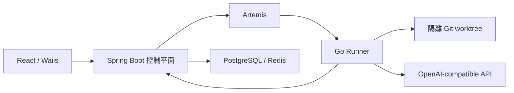

[简体中文](README.md) | [English](README.en.md) | [繁體中文](README.zh-TW.md) | [日本語](README.ja.md)

# ProofCode

ProofCode 是面向可驗證程式碼修改的程式設計 Agent：讀取儲存庫、產生修補檔、執行經過核准的工具、執行測試，並交付可以審閱與復原的修改產物。專案使用 Go Agent 引擎、Spring Boot 控制平面、React Web 介面與 Windows Wails 桌面外殼，服務於日常開發工作流程與資訊工程相關科系的學士畢業專題研究。

核心流程是：**提交目標 → 隔離工作樹 → 工具與核准 → 程式碼修補 → 測試驗證 → 審閱產物 → 套用至原儲存庫**。

## 版本與開發狀態

儲存庫首頁對應 `main`。新增功能分別保存在獨立開發分支；切換分支時，請使用對應分支的文件與設定。

| 分支 | 已發布內容 |
| --- | --- |
| [`main`](https://github.com/lgcyuzusakura/proofcode/tree/main) | 程式設計 Agent 主迴圈、工具核准、Git worktree、任務復原、修改產物、可選 Jev 路由與 Web／桌面入口 |
| [`codex/backend-experiments-data-20261008`](https://github.com/lgcyuzusakura/proofcode/tree/codex/backend-experiments-data-20261008) | 專案／工作區／對話作用域、四路程式碼檢索、重複日誌壓縮、PostgreSQL／Redis 資料閘道、可執行 A–F 對照與 CI |
| [`codex/thesis-ccu-20261008`](https://github.com/lgcyuzusakura/proofcode/tree/codex/thesis-ccu-20261008/thesis) | 附有來源與工程證據的學士畢業專題論文初稿、Word／PDF、參考文獻與重現材料 |
| [`codex/project-data-context-plan-20261008`](https://github.com/lgcyuzusakura/proofcode/blob/codex/project-data-context-plan-20261008/docs/plans/2026-10-08-project-data-context-plan.md) | 自動桌面工程、視覺化資料庫／快取、多版本 RAG 與可回取上下文的後續實作方案 |

視覺化資料庫／快取管理、未匯入資料夾即可開始對話並自動建立桌面工程，以及歷史多版本檢索，皆屬後續開發。後端分支目前使用確定性檢索，尚未設定 embedding；上下文壓縮主要去除重複的成功日誌。六組整合測試中的模型與 Jev 回應來自模擬測試夾具，不能視為真實模型效能或論文改善數據。

## `main` 已實作的功能

- OpenAI-compatible 介面與工具呼叫；主迴圈支援步驟／用量預算、取消、稽核事件與確定性模擬介面。
- 工作區內的檔案讀取、分頁檔案清單、`rg` 搜尋、結構化修補、受限指令與 Git diff。
- 每個任務 attempt 使用獨立 Git worktree，保存檢查點、完整訊息與復原產物。
- 條件式 Main、Scout、Verifier 協作；只有 Main 能修改檔案，Scout／Verifier 使用唯讀工具。
- 可選 Kev／Jev 固定候選工具路由；它負責選擇工具，工具參數仍由生成模型提供。
- Spring Boot 任務 API、資料庫租約、取消／恢復、WebSocket 事件與 PostgreSQL 交易式 Outbox。
- Go Runner 透過 Artemis AMQP 1.0 領取任務，執行儲存庫準備、工具與檢查點回呼。
- React Web 專案／任務入口、即時事件、核准與取消、任務產物時間軸；Windows Wails 桌面入口。
- `proofcode-apply` 在審閱後驗證基線 revision 與乾淨工作區，再套用修補檔。
- 瀏覽器驗證函式庫與 MCP stdio 用戶端已存在，尚未接入 Runner 任務主迴圈。

## 快速啟動

需要 Docker Desktop 與 Docker Compose。真實程式設計任務還需要可用的 OpenAI-compatible 介面設定。

```powershell
git clone https://github.com/lgcyuzusakura/proofcode.git
cd proofcode
Copy-Item .env.example .env
```

在 `.env` 中設定 `MODEL_BASE_URL`、`MODEL_NAME`、`MODEL_API_KEY`，並設定自己的 `DEV_AUTH_TOKEN` 與 `RUNNER_TOKEN`。接著執行：

```powershell
docker compose up --build
```

開啟 [http://localhost:3000](http://localhost:3000)。Compose 會等待 PostgreSQL、Redis、Artemis 與控制平面通過健康檢查後，再啟動相依服務。

目前 Web 介面從瀏覽器儲存空間讀取存取權杖。開啟開發者工具的 Console，將下方佔位符替換為 `.env` 中的 `DEV_AUTH_TOKEN` 後執行：

```javascript
localStorage.setItem("proofcode.token", "<DEV_AUTH_TOKEN>");
location.reload();
```

連接埠衝突時，在 `.env` 中覆寫 `PROOFCODE_*_PORT`，例如 `PROOFCODE_WEB_PORT=3010`、`PROOFCODE_CONTROL_PORT=8090`。

### Windows 桌面

靜態預覽需要 Node.js/npm、Python 3 與 Edge/Chrome。原生建置指令碼固定呼叫 `.tools/bin/wails.exe`，並優先使用 `.tools/go/bin/go.exe`；這些工具未隨儲存庫提供，需先準備本機工具與 WebView2。也可安裝系統 Wails 2.10.2，在 `desktop/native/` 內執行 `wails dev` 或 `wails build`。

```powershell
# 靜態桌面介面預覽
.\desktop\start-desktop.ps1

# 原生 Wails 應用程式，需要 Go/Wails 環境
.\desktop\start-native.ps1

# 重新建置原生應用程式
.\desktop\build-native.ps1

# 停止靜態預覽伺服器
.\desktop\stop-desktop.ps1
```

桌面外殼與共用介面仍依賴控制平面與 Runner 執行任務；靜態預覽僅用於檢查介面。詳細說明請參閱[桌面入口](desktop/README.md)與[原生應用程式](desktop/native/README.md)。

### 工具核准與執行環境

預設寫入檔案與執行指令需要核准。`RUNNER_ALLOW_WRITE=true`、`RUNNER_ALLOW_EXEC=true` 分別允許自動寫入檔案與執行指令；它們不會改變路徑、指令與取消檢查。

Runner 映像包含 Go 1.24、Node.js／npm／npx、Python 3／pytest、Git 與 ripgrep。`RUNNER_ALLOWED_PROGRAMS` 設定可執行程式允許清單；需要 Java、Rust、.NET 等工具鏈時，請擴充映像與允許清單。

Git worktree 提供修改隔離；目前長期執行的容器尚未提供完整的各任務網路、CPU／記憶體隔離，團隊成員 RBAC 也屬後續工作。現有邊界請參閱[安全模型](docs/security.md)。

## 可選 Jev 工具路由

設定既有 TypeSafe-compatible 服務的 `JEV_BASE_URL`。`JEV_MODE=observe` 記錄決策並保留所有工具；`JEV_MODE=route` 在信心度達到 `JEV_MIN_CONFIDENCE` 時，限制本輪工具集合。一般任務遇到低信心度、無效回應或服務不可用時，會退回完整工具清單並記錄事件。預設未啟用路由。

Jev 不產生工具參數、不核准操作，也不能繞過確定性策略。事件 `decision.tool_routed` 保留實際選擇依據；信心度不等於實測正確率。後端實驗分支的 C／F 組要求有效 Jev 路由，設定或服務失敗時會明確失敗，不會靜默變成另一組。

## 審閱並套用修改

Runner 的修改位於隔離工作樹。審閱 `checkpoint` 或 `recovery` 產物後，針對基線 revision 一致且乾淨的原儲存庫執行：

```powershell
$env:PROOFCODE_AUTH_TOKEN = "<your-token>"
go -C agent-engine run ./cmd/proofcode-apply -url http://localhost:8080 -task "<task-id>" -repo "D:\path\to\checkout" -kind checkpoint
```

指令先執行 `git apply --check`，核對 revision 與工作區狀態，通過後套用為尚未暫存的修改。目前開發機若未設定系統 Go，可使用已被忽略的 `.tools/go/bin/go.exe`；容器映像也提供 `proofcode-apply`，可將目標儲存庫掛載至 `/repo` 後呼叫。

## 六組比較與專案資料功能

這些功能位於後端開發分支。可在獨立目錄取得該版本：

```powershell
git clone --branch codex/backend-experiments-data-20261008 https://github.com/lgcyuzusakura/proofcode.git proofcode-backend
cd proofcode-backend
docker compose -f compose.experiments.yml up --build -d runner
docker compose -f compose.experiments.yml run --build --rm verify
docker compose -f compose.experiments.yml down --volumes --remove-orphans
```

測試夾具使用獨立服務與可銷毀資料庫，不發布主機連接埠。A–F 使用固定原始碼版本、獨立任務與工作樹、真實修補與統一測試，再匯出 JSON／CSV。報告寫入 `.tools/experiment-e2e/`；這是工程流程驗證，正式論文對照需要真實回應與已標註的任務集。

PostgreSQL／Redis 資料執行必須取得明確使用者核准，即使 Runner 已啟用自動寫入／執行。憑證留在控制平面；PostgreSQL 交易失敗回復與 Redis 條件補償分別處理。目標提交結果未知時，不會自動重播操作。

詳細文件：[實驗與會話](https://github.com/lgcyuzusakura/proofcode/blob/codex/backend-experiments-data-20261008/docs/backend-experiments.md) · [檢索與壓縮](https://github.com/lgcyuzusakura/proofcode/blob/codex/backend-experiments-data-20261008/docs/backend-context.md) · [資料閘道](https://github.com/lgcyuzusakura/proofcode/blob/codex/backend-experiments-data-20261008/docs/backend-data.md)。

## 架構與目錄



| 目錄 | 內容 |
| --- | --- |
| `agent-engine/` | Go Agent、Runner、工具、工作樹、瀏覽器與 MCP |
| `control-plane/` | Java 控制平面、任務狀態、核准與可靠派發 |
| `frontend/` | 共用 React 介面與 Web 應用程式 |
| `desktop/` | Windows 預覽啟動器與 Wails 桌面外殼 |
| `protocol/` | 版本化訊息與事件契約 |
| `compose*.yml` | 容器啟動、測試與聯調設定 |
| `docs/` | 架構、安全、驗收與各分支專項文件 |

[架構說明](docs/architecture.md) · [安全模型](docs/security.md) · [驗收目標](docs/acceptance.md)。驗收文件中的效能目標是開發目標，不是已測量的基準結果。

## 開發驗證

分別執行三項檢查，避免一個容器先結束後中止其他檢查：

```powershell
docker compose -f compose.test.yml run --rm agent-test
docker compose -f compose.test.yml run --rm control-test
docker compose -f compose.test.yml run --rm frontend-test
```

單元與契約檢查不需要模型 key。後端分支另包含 GitHub Actions 的 Go／Java／前端檢查與六組服務整合測試工作流程。

`compose.smoke.yml` 提供模擬串流介面的端到端整合測試：建立測試原始碼、執行真實測試並產生檢查點。它驗證服務連接，不評估模型能力。真實任務仍使用已設定的生成介面。
