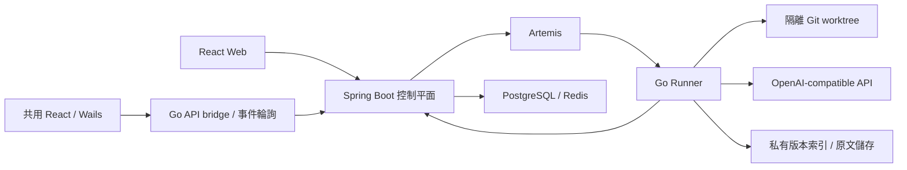

[简体中文](README.md) | [English](README.en.md) | [繁體中文](README.zh-TW.md) | [日本語](README.ja.md)

# ProofCode

ProofCode 是面向可驗證程式碼修改的程式設計 Agent：讀取儲存庫、產生修補檔、執行經過核准的工具、執行測試，並交付可以審閱與復原的修改產物。專案使用 Go Agent 引擎、Spring Boot 控制平面、共用 React Web／桌面介面與 Windows Wails 應用程式，服務於日常開發工作流程與資訊工程相關科系的學士畢業專題研究。

核心流程是：**提交目標 → 隔離工作樹 → 工具與核准 → 程式碼修補 → 測試驗證 → 審閱產物 → 套用至原儲存庫**。

## 版本與開發狀態

本文對應 `codex/project-workspace-bootstrap` 實作分支，該分支尚未合併至 `main`。儲存庫首頁仍對應 `main`；請依下表選擇版本，並使用該分支的文件與設定。

| 分支 | 內容範圍 |
| --- | --- |
| [`main`](https://github.com/lgcyuzusakura/proofcode/tree/main) | 程式設計 Agent 主迴圈、工具核准、Git worktree、任務復原、修改產物、可選 Jev 路由、Web 入口與桌面介面原型 |
| [`codex/project-workspace-bootstrap`](https://github.com/lgcyuzusakura/proofcode/tree/codex/project-workspace-bootstrap) | 目前實作：桌面工程與持久對話、共用 UI／API 代理、原始碼快照與修補保護、專案資料庫／快取工作台、版本化 RAG／原文回取、A–F v2 對照 |
| [`codex/backend-experiments-data-20261008`](https://github.com/lgcyuzusakura/proofcode/tree/codex/backend-experiments-data-20261008) | 早期後端版本：專案／工作區／對話作用域、四路文字檢索、重複日誌去重、PostgreSQL／Redis 資料閘道、A–F v1 對照與 CI |
| [`codex/thesis-ccu-20261008`](https://github.com/lgcyuzusakura/proofcode/tree/codex/thesis-ccu-20261008/thesis) | 附有來源與工程證據的學士畢業專題論文初稿、Word／PDF、參考文獻與重現材料 |
| [`codex/project-data-context-plan-20261008`](https://github.com/lgcyuzusakura/proofcode/blob/codex/project-data-context-plan-20261008/docs/plans/2026-10-08-project-data-context-plan.md) | 本輪開發之前的方案與設計取捨，保留為設計記錄 |

目前實作分支已接通桌面工程、資料工作台、歷史快照檢索與持久上下文回取。檢索使用確定性索引，沒有 embedding。工程整合測試中的模型與 Jev 使用模擬服務，檢索率、幻覺率和速度收益尚未透過真實模型任務集測量，不能寫成論文改善數據。

## `main` 已實作的功能

- OpenAI-compatible 介面與工具呼叫；主迴圈支援步驟／用量預算、取消、稽核事件與確定性模擬介面。
- 工作區內的檔案讀取、分頁檔案清單、`rg` 搜尋、結構化修補、受限指令與 Git diff。
- 每個任務 attempt 使用獨立 Git worktree，保存檢查點、完整訊息與復原產物。
- 條件式 Main、Scout、Verifier 協作；只有 Main 能修改檔案，Scout／Verifier 使用唯讀工具。
- 可選 Kev／Jev 固定候選工具路由；它負責選擇工具，工具參數仍由生成模型提供。
- Spring Boot 任務 API、資料庫租約、取消／恢復、WebSocket 事件與 PostgreSQL 交易式 Outbox。
- Go Runner 透過 Artemis AMQP 1.0 領取任務，執行儲存庫準備、工具與檢查點回呼。
- React Web 專案／任務入口、即時事件、核准與取消、任務產物時間軸；Windows Wails 桌面介面原型與已遮蔽敏感資訊的設定展示。
- `proofcode-apply` 在審閱後驗證基線 revision 與乾淨工作區，再套用修補檔。
- 瀏覽器驗證函式庫與 MCP stdio 用戶端已存在，尚未接入 Runner 任務主迴圈。

## 目前實作分支

| 功能 | 實際實作 |
| --- | --- |
| 專案與對話 | 專案 → 工作區 → 對話 → 任務歸屬鏈；按專案／資料夾切換對話，持久保存使用者與助手訊息；一般聊天與程式碼任務分開執行。 |
| 無資料夾聊天 | 原生 Windows 透過 Desktop KnownFolder 在實際桌面的 `ProofCode-Projects/<名稱>_<UUID>` 建立工程；相同 bootstrap ID 可重試，絕對路徑僅保存在本機目錄登記檔。Web 可建立 SCRATCH 專案，但不能建立用戶端桌面目錄。 |
| 真實原始碼執行 | 原生端匯入本機資料夾，捕獲允許的目前檔案位元組，包括 dirty 與允許的未追蹤檔案；控制平面保存不可變 manifest，Runner 核對入列雜湊後在隔離工作樹執行。Web SCRATCH 後續的程式碼任務使用已保存的原始碼結果。 |
| 共用介面與傳輸 | Web 與 Wails 使用共用 React 工作台；原生 `/api/` 呼叫透過 Go bridge 存取控制平面，依持久事件序號輪詢。Web 使用 WebSocket，斷線時補取持久事件。 |
| 修改審閱與套用 | 顯示真實 checkpoint／recovery diff；本機套用先核對原快照 manifest，在暫存 Git 儲存庫驗證修補檔，檢查目標路徑與逐檔原始位元組，並保存本機套用日誌與復原記錄。 |
| 多版本程式碼 RAG | 目前 generation 與明確選擇的歷史 snapshot 分開查詢；Go 使用 `go/ast`，其他語言明確回退至 line-regex；詞項／符號／引用／測試倒排索引經加權 RRF 與涵蓋預算選擇，證據綁定檔案版本、雜湊與行號。 |
| 可回取壓縮 | 完整 transcript、工具 JSON 與約束台帳先持久化；成功日誌去重與完整協定群組預算裁剪後保留 `context_read` 導航。所有使用者要求、錯誤、核准／拒絕與 data 操作受保護，超預算明確失敗。 |
| 資料庫與快取 | 獨立 DataSession 管理會話；連線、結構、計畫、稽核與復原依專案隔離。PostgreSQL 欄位可拖入單表查詢畫布，支援條件／排序／分頁、結果編輯與受限遷移；Redis string 的 SCAN／GET／SET／DELETE／EXPIRE 與 TTL 管理。 |

資料讀取、寫入與復原都經過「計畫 → 預覽 → 使用者核准 → 執行」，一般任務的自動寫入開關不能繞過核准。中繼資料檢查、連線驗證與唯讀 EXPLAIN 可在核准前進行；「核准前零執行」指查詢計畫、寫入及復原執行。PostgreSQL 交易內失敗自動回滾；已提交資料列修改與 Redis 鍵透過加密快照建立新的條件復原計畫，必須再次核准。未知提交結果不自動重放。

### 實作邊界

- PostgreSQL 尚不支援原始 SQL、JOIN、彙總、任意函式與預存程序；遷移僅開放受限建表、可空欄位與一般索引，尚無已提交遷移的通用自動 inverse。
- Redis 目前是 standalone 的受控命名空間 string 操作，不支援 Cluster、hash／list／set／zset 或任意指令；條件復原不能取代跨資料庫交易。
- 歷史 RAG 只保存系統捕獲的版本，不會自動匯入全部 Git 歷史；沒有 embedding、學習式重排或多語言 AST。熱查詢仍核驗並掃描原始碼，尚未證明速度或準確率優勢。
- 壓縮保留原文不代表模型理解無損；Token 依位元組估算，真實 usage 另行記錄。全域使用者／Runner bearer token 不是團隊 RBAC 或逐使用者專案授權。
- 修補套用日誌支援復原檢查，但不能保證多檔寫入的作業系統級原子性，也不能阻止外部程式同時修改檔案。

專項說明：[版本檢索與上下文](docs/backend-context.md) · [資料工作台與復原](docs/backend-data.md) · [實驗與對話](docs/backend-experiments.md)。

## 快速啟動

需要 Docker Desktop 與 Docker Compose。真實程式設計任務還需要可用的 OpenAI-compatible 介面設定。

```powershell
git clone --branch codex/project-workspace-bootstrap https://github.com/lgcyuzusakura/proofcode.git
cd proofcode
Copy-Item .env.example .env
```

在 `.env` 中設定 `MODEL_BASE_URL`、`MODEL_NAME`、`MODEL_API_KEY`，並設定自己的 `DEV_AUTH_TOKEN` 與 `RUNNER_TOKEN`。接著執行：

```powershell
docker compose up --build
```

Runner 使用任務的 `model` 欄位。共用聊天／程式碼任務輸入框接受服務提供者支援的任意模型 ID，三個建議項僅為提示。僅修改 `.env` 的 `MODEL_NAME` 不會覆寫任務模型。桌面顯示的 Codex 脫敏設定不會把 API key 自動傳給 Runner；仍需另外設定執行服務。

開啟 [http://localhost:3000](http://localhost:3000)。Compose 會等待 PostgreSQL、Redis、Artemis 與控制平面通過健康檢查後，再啟動相依服務。

共用介面的帳戶設定可保存存取權杖，Web 與原生桌面各自使用本機儲存空間。Web 也可開啟開發者工具的 Console，將下方佔位符替換為 `.env` 中的 `DEV_AUTH_TOKEN` 後執行：

```javascript
localStorage.setItem("proofcode.token", "<DEV_AUTH_TOKEN>");
location.reload();
```

連接埠衝突時，在 `.env` 中覆寫 `PROOFCODE_*_PORT`，例如 `PROOFCODE_WEB_PORT=3010`、`PROOFCODE_CONTROL_PORT=8090`。

### Windows 桌面

靜態預覽需要 Node.js/npm、Python 3 與 Edge/Chrome。原生建置需要 Go、Wails 2.10.2、Git 與 WebView2；預設工具目錄為 `.tools/go` 與 `.tools/bin`，也可設定 `PROOFCODE_GO_ROOT` 與 `PROOFCODE_WAILS_BIN`。工具未隨儲存庫提供。也可用系統 Wails 在 `desktop/native/` 內執行 `wails dev` 或 `wails build`。

```powershell
# 靜態桌面介面預覽
.\desktop\start-desktop.ps1

# 原生 Wails 應用程式，需要 Go/Wails 環境
.\desktop\start-native.ps1

# 重新建置原生應用程式
.\desktop\build-native.ps1

# 停止靜態預覽伺服器
.\desktop\stop-desktop.ps1
```

原生桌面已接通控制平面 API，並透過持久事件輪詢讀取真實任務進度；它不會自行啟動控制平面、訊息佇列或 Runner。啟動這些服務，並在帳戶設定填入 `DEV_AUTH_TOKEN`。原生代理預設連接 `http://127.0.0.1:8080`，啟動應用程式前可用 `PROOFCODE_CONTROL_PLANE_URL` 更改位址。靜態預覽只顯示 UI，沒有原生資料夾能力或控制平面代理。詳細說明請參閱[桌面入口](desktop/README.md)與[原生應用程式](desktop/native/README.md)。

### 工具核准與執行環境

預設寫入檔案與執行指令需要核准。`RUNNER_ALLOW_WRITE=true`、`RUNNER_ALLOW_EXEC=true` 分別允許自動寫入檔案與執行指令；它們不會改變路徑、指令與取消檢查。

Runner 映像包含 Go 1.24、Node.js／npm／npx、Python 3／pytest、Git 與 ripgrep。`RUNNER_ALLOWED_PROGRAMS` 設定可執行程式允許清單；需要 Java、Rust、.NET 等工具鏈時，請擴充映像與允許清單。

Git worktree 提供修改隔離；目前長期執行的容器尚未提供完整的各任務網路、CPU／記憶體隔離。身分驗證使用獨立全域使用者／Runner token，尚無團隊成員 RBAC 或專案成員權限。現有邊界請參閱[安全模型](docs/security.md)。

## 可選 Jev 工具路由

設定既有 TypeSafe-compatible 服務的 `JEV_BASE_URL`。`JEV_MODE=observe` 記錄決策並保留所有工具；`JEV_MODE=route` 在信心度達到 `JEV_MIN_CONFIDENCE` 時，限制本輪工具集合。一般任務遇到低信心度、無效回應或服務不可用時，會退回完整工具清單並記錄事件。預設未啟用路由。

Jev 不產生工具參數、不核准操作，也不能繞過確定性策略。事件 `decision.tool_routed` 保留實際選擇依據；信心度不等於實測正確率。後端實驗分支的 C／F 組要求有效 Jev 路由，設定或服務失敗時會明確失敗，不會靜默變成另一組。

## 審閱並套用修改

Runner 的修改位於隔離工作樹。審閱 `checkpoint` 或 `recovery` 產物後，針對基線 revision 一致且乾淨的原儲存庫執行：

```powershell
$env:PROOFCODE_AUTH_TOKEN = "<your-token>"
go -C agent-engine run ./cmd/proofcode-apply -url http://localhost:8080 -task "<task-id>" -repo "D:\path\to\checkout" -kind checkpoint
```

指令先執行 `git apply --check`，核對 revision 與工作區狀態，通過後套用為尚未暫存的修改。目前開發機若未設定系統 Go，可使用已被忽略的 `.tools/go/bin/go.exe`；容器映像也提供 `proofcode-apply`，可將目標儲存庫掛載至 `/repo` 後呼叫。

上述 CLI 適用於 Git 儲存庫基線。目前原生本機工程可在真實 diff 審閱視窗中核准套用，透過上傳時的檔案 manifest 與目前位元組核驗來保護既有 dirty 修改；不需要先將這些修改提交至遠端儲存庫。

## 六組比較與專案資料功能

目前分支使用固定設定版本 `proofcode.experiment.v2-context`，提供可實際執行的六組對照：

| 組 | 設定 |
| --- | --- |
| A | 純 LLM，Agent 無工具；獨立 evaluator 套用其最終 diff 並測試 |
| B | LLM + 工具 + 額外確定性安全策略 |
| C | LLM + 工具 + 必需 Jev 路由 |
| D | LLM + 工具 + 版本化混合程式碼 RAG |
| E | D + 持久可回取上下文壓縮 |
| F | E + 確定性安全策略 + 必需 Jev + 未解決失敗回饋 + 專案資料工具 |

所有組均保留工作區、路徑、指令與資料核准底線。v1 與 v2 的演算法和設定不同，不應混成同一批實驗。可在獨立目錄取得目前版本：

```powershell
git clone --branch codex/project-workspace-bootstrap https://github.com/lgcyuzusakura/proofcode.git proofcode-backend
cd proofcode-backend
docker compose -f compose.experiments.yml up --build -d runner
docker compose -f compose.experiments.yml run --build --rm verify
docker compose -f compose.experiments.yml down --volumes --remove-orphans
```

測試夾具使用獨立服務與可銷毀資料庫，不發布主機連接埠。A–F 使用固定原始碼版本、獨立任務與工作樹、真實修補與統一測試，再匯出 JSON／CSV。報告寫入 `.tools/experiment-e2e/`；這是工程流程驗證，正式論文對照需要真實回應與已標註的任務集。

資料連線保存 `secretRef`，憑證由控制平面的 `DATA_SECRET_<引用>` 環境變數解析。Compose 提供 `DATA_SECRET_PG_DEV` 與 `DATA_SECRET_REDIS_DEV`；PostgreSQL 資料列修改和 Redis 復原快照需要 `DATA_SNAPSHOT_KEY`（32 位元組隨機金鑰的 Base64）。不能把測試金鑰或真實憑證寫進公開儲存庫。

詳細文件：[實驗與會話](docs/backend-experiments.md) · [檢索與壓縮](docs/backend-context.md) · [資料閘道](docs/backend-data.md)。

## 架構與目錄



| 目錄 | 內容 |
| --- | --- |
| `agent-engine/` | Go Agent、Runner、工具、工作樹、瀏覽器與 MCP |
| `control-plane/` | Java 控制平面、任務狀態、核准與可靠派發 |
| `frontend/` | 共用 React 介面與 Web 應用程式 |
| `desktop/` | Wails 原生工程、API 代理、目錄登記、快照與修補套用 |
| `protocol/` | 版本化訊息與事件契約 |
| `compose*.yml` | 容器啟動、測試與聯調設定 |
| `docs/` | 架構、安全、驗收與各分支專項文件 |

[架構說明](docs/architecture.md) · [安全模型](docs/security.md) · [驗收目標](docs/acceptance.md)。驗收文件中的效能目標是開發目標，不是已測量的基準結果。

## 開發驗證

分別執行三項檢查，避免一個容器先結束後中止其他檢查：

```powershell
docker compose -f compose.test.yml run --rm agent-test
docker compose -f compose.test.yml run --rm control-test
docker compose -f compose.test.yml run --rm frontend-test
```

單元與契約檢查不需要模型 key。目前分支包含 GitHub Actions 的 Go／Java／前端檢查與六組服務整合測試工作流程。真實 PostgreSQL／Redis 適配器測試需要獨立的可銷毀實例，設定請參閱資料文件。

`compose.smoke.yml` 提供模擬串流介面的端到端整合測試：建立測試原始碼、執行真實測試並產生檢查點。它驗證服務連接，不評估模型能力。真實任務仍使用已設定的生成介面。
