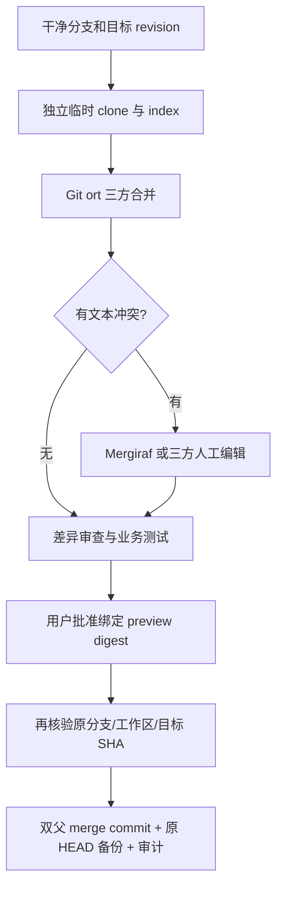

# 结构化合并、语言服务、断点调试和 DevTools

日期：2026-10-09。实现分支：`codex/structured-merge-debug-tools`。本文区分已实现行为、工程验证与研究方向，不将夹具测试写成真实模型效果数据。

## 1. 同文件为什么会冲突

Git 不以文件作为最小冲突单位。两人修改同一文件的不同函数，且文本块分开时，普通三方合并通常就能合并。冲突更常见于相邻声明、同行内容、移动后编辑、格式化影响大段文本，以及同一表达式的不同修改。

你的支付功能和订单分页案例，可以使用三层处理：

1. Git ort 先进行文本三方合并，不需要模型。
2. 对 Git 剩下的文本冲突，使用 Mergiraf 解析 base/ours/theirs，尝试组合独立语法树修改，不需要模型。
3. 对真正重叠的修改保留冲突，由开发者查看三方内容和测试结果，再明确批准。

例如 base 为 `function notify(status) { return status; }`，一方只改参数为 `status, page`，另一方只改返回表达式为 `status + 1`。文本合并可能冲突，语法树合并可以保留两处修改。若两方分别把同一返回值改为 2 和 3，则不能从语法结构推断哪个符合业务，应保留冲突。

语法兼容不能证明业务正确。修改订单查询的分页参数可能改变支付调用方的契约，即使代码可以编译也需要测试。当前没有让 LLM 自动决定业务冲突，没有调用模型的合并路径，其模型 Token 消耗为 0；这不是整个开发任务的 Token 为 0，也没有测量总体节省比例。

## 2. 调研项目与文章

| 来源 | 能力与参考价值 | 本次选择 |
| --- | --- | --- |
| [Mergiraf](https://codeberg.org/mergiraf/mergiraf) | 多语言语法树合并，支持移动与编辑、独立语法元素组合；有 Windows 发布包 | 外部可选引擎，测试版本 v0.20.0 |
| [Mergiraf 使用说明](https://mergiraf.org/usage.html) / [冲突案例](https://mergiraf.org/conflicts.html) / [语言列表](https://mergiraf.org/languages.html) | 解释三方输入、solve/review 和实际边界 | 作为行为依据；语言支持以引擎版本文档为准 |
| [Spork](https://github.com/ASSERT-KTH/spork) / [论文](https://arxiv.org/abs/2202.05329) | Java 结构化合并与格式保留，论文题为 Spork: Structured Merge for Java with Formatting Preservation | 相关研究，未引入运行时 |
| [IntelliMerge](https://github.com/symbolk/intellimerge) | 针对 Java 的图模型和重构感知三方合并 | 重构追踪的后续参考 |
| [JDime](https://github.com/se-sic/jdime) | Java 语法合并工具 | 专用语言路线的参考 |
| [jsFSTMerge](https://github.com/AlbertoTrindade/jsFSTMerge) / [s3m](https://github.com/guilhermejccavalcanti/s3m) | JavaScript/半结构化合并研究项目 | 相关研究，未引入运行时 |
| [Git merge-tree](https://git-scm.com/docs/git-merge-tree) | 不改工作区的合并计算机制 | 当前为方便人工编辑使用隔离 clone + ort |
| [Git rerere](https://git-scm.com/docs/git-rerere) | 复用曾经人工解决的冲突 | 尚未启用；不能当作已交付缓存 |
| [awesome-merge-drivers](https://github.com/jelmer/awesome-merge-drivers) | 不同文件格式的合并驱动目录 | 后续格式专用策略参考 |

官方 [Mergiraf 首页](https://mergiraf.org/) 包含终端演示录屏，资源为 [review session](https://mergiraf.org/asciinema/session.cast) 和 [solve](https://mergiraf.org/asciinema/solve.cast)。这是可播放的 asciinema 终端录屏，不是未经核实的视频标题或下载包。检索以官方文档、论文和项目仓库为主，没有宣称全网穷尽。

Mergiraf 官方主仓位于 Codeberg；GitHub 上的 [mirror-mergiraf](https://github.com/qundao/mirror-mergiraf) 是非官方镜像。引擎许可为 GPL-3.0-only，ProofCode 当前通过外部进程调用，不把引擎二进制提交或打包进仓库。未来分发该引擎时需要满足对应许可。这里的集成和审批机制属于本项目实现，语法合并算法来源应引用 Mergiraf，不能称为自创算法。

## 3. 已实现合并流程

入口位于独立 Git 页，主对话保持原有布局。



API 为 `PreviewProjectMerge`、`ResolveProjectMerge`、`ApplyProjectMerge` 和 `DiscardProjectMerge`。预览在独立 index、refs 和 config 中进行；禁用全局/系统 config、hooks、外部 attributes、外部 diff/textconv 和签名。三方输入取真实 Git index stages，不从冲突标记反向猜测版本。

未批准不会修改原工作文件、index 或分支。revision 绑定双方 SHA、工作 diff、暂存 diff、index entries 和冲突 stages。目标分支移动、原工作区变化、外部修改临时结果或错误项目 handle 都拒绝批准。批准后用 `commit-tree` 保留两个父提交，保存 `refs/proofcode/backups/<preview ID>`，在本机 registry 的 `merge-history` 中记录批准与应用状态。

允许在显示的临时路径运行测试。测试生成的未追踪文件不会进入批准提交；若测试改了已跟踪代码或 index，原 digest 会失效，应重新预览。不能将外部工具与工作区并发修改当成原子事务；批准期间仍需避免其他程序同时操作仓库。

受保护路径、符号链接和子模块会拒绝。单文本文件不超过 1 MiB，总 diff 不超过 2 MiB。删除、重命名、二进制和模式冲突仅提示外部处理；未解决冲突不能批准。缺少 Mergiraf 时仍可用 Git 和人工三方解决，不会静默调用模型。

## 4. LSP 语言服务

`desktop/native/protocol.go` 提供标准 Content-Length + JSON-RPC stdio 传输。配置程序和字符串参数数组，工作目录固定在当前项目；不拼接 shell。接口为 `StartProjectProtocol`、`ProjectProtocolRequest`、`GetProjectProtocol` 和 `StopProjectProtocol`。

编辑器已接入 initialize/initialized、didOpen/didChange/didClose、completion、hover、definition 与 publishDiagnostics。按服务器能力选择全量或增量同步；增量模式采用替换整个旧文档范围的合法 TextDocumentContentChangeEvent。补全支持基础 label/insertText/TextEdit range，定义跳转限制在当前项目，诊断显示 Monaco markers。

这是标准协议接入，不等于所有语言服务器扩展都已支持。尚无 rename、format、workspace edit 审批、多文件编辑事务、完整 snippets、additionalTextEdits、CompletionItem resolve 或语义 token。自动 `workspace/applyEdit` 会返回拒绝。某些服务还需要用户安装运行时、参数和项目配置。基础 Python 的实际联调使用 [python-lsp-server](https://github.com/python-lsp/python-lsp-server) 1.13.1。

## 5. DAP 断点调试

同一桥接支持 DAP 请求/响应和事件。界面配置 adapter 程序与 launch/attach JSON，支持初始化、initialized 后下发断点和 configurationDone、暂停、继续、步过/步入/步出、调用堆栈、作用域、变量与表达式求值。Monaco 左侧 gutter 可增删行断点。基础 Python 联调使用 [debugpy](https://github.com/microsoft/debugpy) 1.8.17。

每项目每协议最多一个活动进程；请求超时 30 秒，单消息 2 MiB，header 8 KiB，最多保留 200 个事件且不超过 2 MiB，溢出明确提示。停止、离开 IDE 或应用退出会停止进程树。DAP `runInTerminal` 等反向请求不支持，需要 `internalConsole`；没有 TCP/远程 adapter、条件断点、watch 面板或内存视图。用户启动的服务和被调试程序具有本机用户权限，表达式求值本身可能改变程序状态。

## 6. 完整 Chromium DevTools

这里使用浏览器自带 DevTools，不是手写一个 Console 面板冒充完整 DevTools。原生浏览器以临时 UserDataDir 启动，调试端口绑定 127.0.0.1，仅允许 `devtools://devtools` origin。点击按钮在另一临时配置的可见 Chromium 窗口打开 bundled inspector，WebSocket 指向当前项目的准确 target ID。

Elements、Console、Sources、Network、Performance、Memory、Application 等是该 Chromium 版本提供的功能，实际内容以安装的浏览器为准。独立检查器能读写当前页面，包括执行 JavaScript；不会连接个人日常浏览器的会话。关闭项目浏览器会关闭检查器并清理临时配置。网页预览区仍按操作更新截图，DevTools 是独立窗口，没有宣称嵌入截图内部。

## 7. 配置示例

本机已有测试工具路径：

```powershell
$env:PROOFCODE_MERGIRAF_EXECUTABLE='D:/proofcode/.tools/mergiraf/mergiraf.exe'
```

IDE 的 LSP 程序填写已安装 Python 路径，参数填写 `["-m","pylsp"]`；语言 ID 为 `python`。DAP 使用同一 Python 路径，参数为 `["-m","debugpy.adapter"]`。launch 配置中的 `python` 应指向项目 Python 环境，`program` 可为项目相对路径：

```json
{"type":"python","request":"launch","name":"Project","program":"main.py","console":"internalConsole","stopOnEntry":false}
```

其他语言服务或 adapter 使用各自的标准 stdio 程序和参数。没有本地模型依赖，也没有免费模型配置。

## 8. 验证与后续研究

真实引擎测试包含独立函数、同行独立 AST 修改、真正表达式冲突、未批准隔离、stale revision、target 移动、受保护路径、双父提交和 HEAD 备份。真实 Python 服务测试包含 LSP hover 与 DAP breakpoint/stack/scopes/variables/evaluate/continue。完整 DevTools 测试通过检查器 SDK 连接当前 target，并在目标 Runtime 中读取页面 DOM，确认不是空检查器窗口。

UI 联调和最终构建结果记录在 [验收记录](verification-structured-merge-2026-10-09.md)。这些是工程测试，不是论文准确率和模型性能实验。后续若做论文比较，可固定同一组三方样本，比较 Git、Git + Mergiraf、人工、LLM 辅助，并记录冲突数量、保留双方修改、编译/测试结果、延迟和真实 Token；不能先写提升百分比再找数据。
