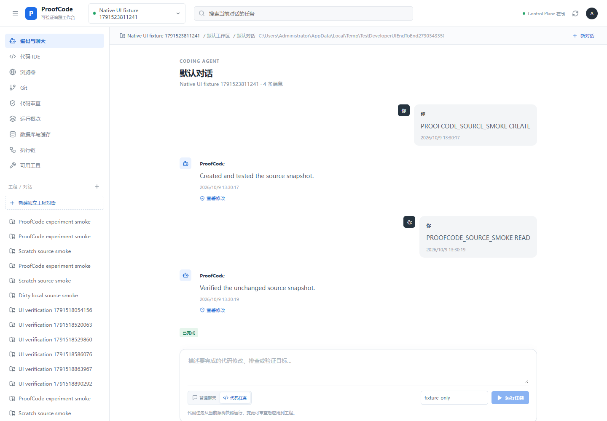
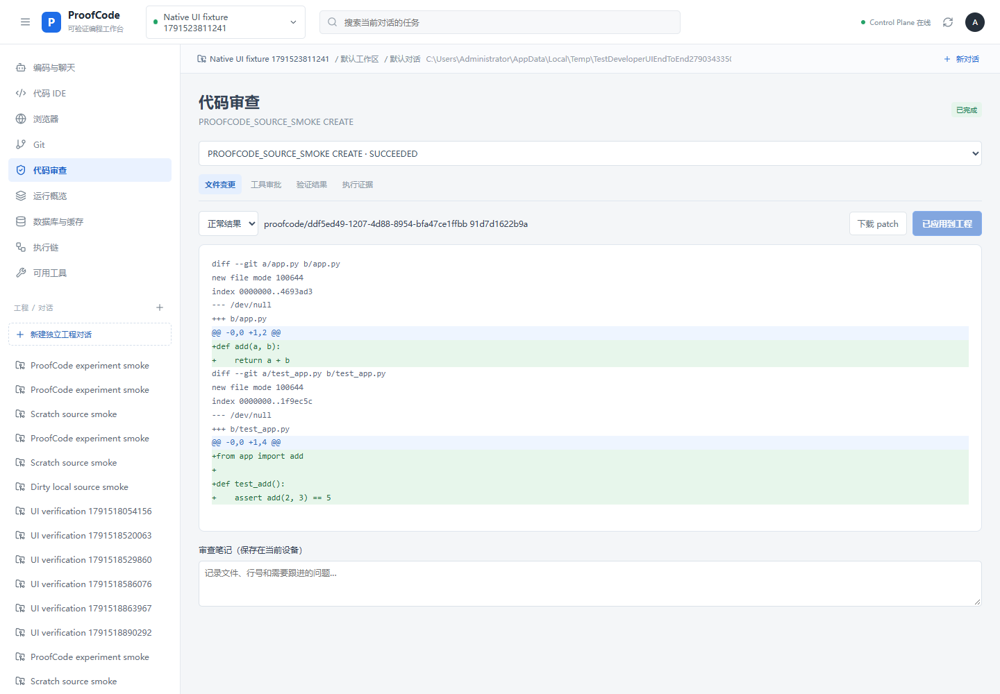
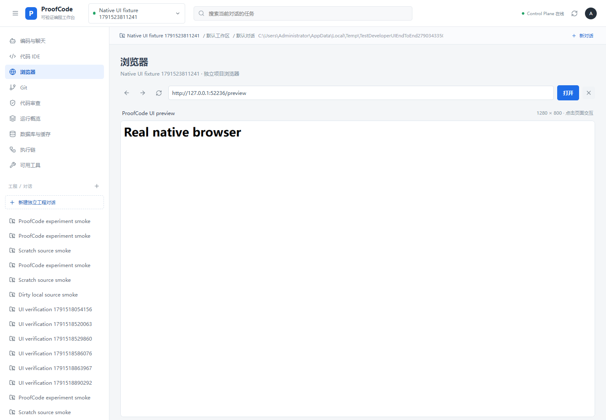
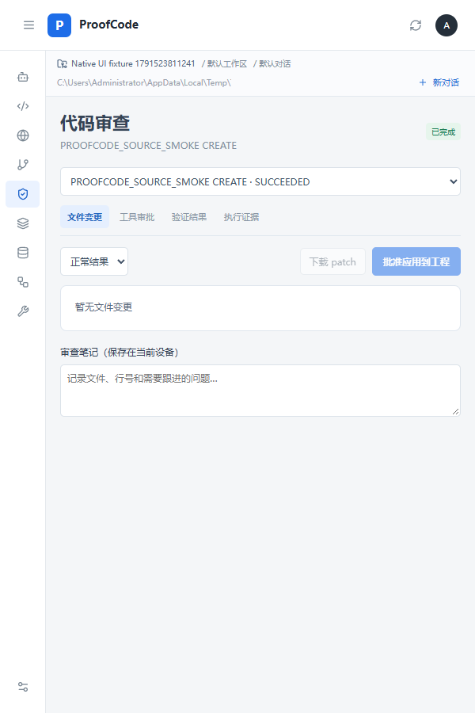

# 2026-10-09 对话与开发工作台验收

分支：`codex/chat-ide-browser-git`；基线：`b0e4e47905b2717afcd47d48fe4e274b26e2366f`（项目/数据/上下文实现）。本记录是工程验收。模型响应来自确定性夹具，不是论文的真实模型能力或性能数据。

## 本轮交付

- 默认对话页：居中白底、Markdown/表格/代码复制、实时文字、Enter发送与中文输入法保护；审查详情移到独立页面。
- “查看修改”绑定消息的 task ID；切回合时旧事件、审批和补丁不显示为新回合产物。
- Monaco IDE：真实文件读取/新建/保存，SHA-256版本检查、Windows条件写、保存历史及按工程恢复设备草稿。
- 本机命令：实际程序与JSON参数、工程工作目录、输出与退出码、单工程互斥、Windows停止子进程树、npm/npx直接Node入口。
- Git：真实状态和diff、精确暂存/取消、提交/历史、创建/切换分支、origin配置、获取远程、仅快进拉取和推送；核验Git状态指纹并保护内部路径。
- 独立浏览器：真实Edge/Chrome截图、点击/输入/Enter/滚动、导航、页面文本与控制台；临时配置与工程作用域。
- 普通CODE任务可选browser工具，沿用执行批准；CHAT和A–F对照不添加此工具。任务缓存及内部浏览器产物不进入源码补丁，已跟踪文件仍保留。
- Web只读源码API增加用户认证与project/workspace/snapshot归属验证；四语言说明、参考依赖和Windows CI更新。

## 验证结果

| 验证 | 实际结果 |
| --- | --- |
| Go引擎 `go test ./... -count=1` | 全部测试包通过；包括真实Edge任务浏览器连续调用和取消 |
| 原生Go `go test ./... -count=1 -v` | 通过；包括文件冲突/路径/保存历史、Git精确暂存与版本/分支、真实命令/子进程停止、真实浏览器交互与隔离 |
| Java相关集成和HTTP授权 | 两个suite，共9项，失败0、错误0、跳过0；包含源码内容作用域和用户/runner凭据区分 |
| 前端 `npm test` | 16项通过 |
| 共享Web生产构建 | TypeScript和Vite通过 |
| 桌面独立依赖构建 | 隐藏共享Web的node_modules，只保留native frontend依赖，TypeScript和Vite构建通过；随后恢复原目录 |
| Windows production build | Wails 2.10.2成功生成windows/amd64应用与生产绑定 |
| 原生方法与React UI联调 | 真实编辑、切页恢复草稿、保存、Git提交、命令输出、浏览器截图、Agent产物批准应用、两回合精准审查和600px移动窗口通过；pageerror为0 |
| A–F全链路回归 | `smoke/experiments/verify.py`通过；六组实际配置、源码任务/pytest、连续聊天、数据批准/重复/拒绝/隔离断言通过 |
| npm audit | Web与native frontend均报告0 vulnerabilities（本次锁文件与查询时点） |
| Chromium容器启动 | 默认Docker用户namespace被拒绝；显式no-sandbox配置后，以非root用户启动并输出真实DOM，未增加容器权限 |

UI联调通过临时loopback传输调用真实App方法，Wails生产绑定单独由构建验证。它不是对打包WebView2窗口进行鼠标自动化；没有把测试替身当成文件、Git或浏览器功能实现。

A–F回归第一次因前次UI测试留下的fixture数据库值而停止在初始状态断言。只重置独立`proofcode-experiments`的demo测试表后再次运行通过，未接触用户业务数据库。该夹具结果仍不能转成毕业论文准确率、Token收益或速度提升数据。

## 截图

以下来自实际React页面、真实原生方法及确定性Agent夹具：

## 已说明的边界

本机编辑/命令/Git/浏览器依赖Windows桌面与注册目录；Web IDE只读任务源码。预览按操作刷新截图，没有完整DevTools或视频能力。IDE没有通用LSP、断点调试或扩展市场。Git没有merge/rebase/stash和自动冲突解决。现有共享bearer认证与容器隔离不能宣称团队RBAC或企业生产认证。完整操作、参考项目与限制见[开发工作台文档](developer-workspace.md)。

变更保存在独立开发分支，原`D:\proofcode`未提交内容保留。本机备份位于`D:\proofcode-backups\implementation-20261009\chat-ide-browser-git`，含工作文件、补丁和Git bundle。
